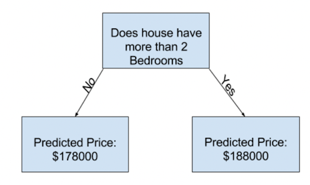

# Machine learning introduction

Summary: This project is an introduction to machine learning and especially to primary data analysis with some practical basics.

💡 [Tap here](https://new.oprosso.net/p/4cb31ec3f47a4596bc758ea1861fb624) **to leave your feedback on the project**. It's anonymous and will help our team make your educational experience better. We recommend completing the survey immediately after the project.

## Contents

1. [Chapter I. Preamble](#chapter-i-preamble)
2. [Chapter II. Introduction](#chapter-ii-introduction) \
    2.1. [Steps to build a model](#steps-to-build-a-model) \
    2.2. [ML algorithms](#ml-algorithms) \
        2.2.1. [Supervised learning](#supervised-learning) \
        2.2.2. [Unsupervised learning](#unsupervised-learning)
3. [Chapter III. Goal](#chapter-iii-goal) 
4. [Chapter IV. Instructions](#chapter-iv-instructions)
5. [Chapter V. Task](#chapter-v-task)

## Chapter I. Preamble

"With the ever-increasing amount of data in electronic form, the need for automated methods of data analysis continues to grow. The goal of machine learning is to develop methods that can automatically detect patterns in data, and then use the discovered patterns to predict future data or other outcomes of interest" — we start our course with the definition of machine learning from one of the widely known books — "Machine Learning A Probabilistic Perspective" by Kevin P. Murphy. 

There are a lot of problems solved by ML methods:
* The problem of predicting housing prices. We try to define a cost of an object with a set of features such as quality of repair, footage and area.
* What disease does the patient have if we observe a certain set of symptoms?
* Will the customer of the bank pay back the loan if his income is X and he has a good credit history?
* What products are suitable to show to the user on the main page of the online store to speed up his/her successful search?

In most cases we can answer all these questions. But it is much better to have a machine that can do this work without bias and many times faster. Data requires automated methods of analysis, which is what machine learning provides. We define machine learning as a set of methods that can automatically discover patterns in data and then use the discovered patterns to predict future data.

In summary, this course will show you what machine learning is. After reading all the materials and doing the labs, you will master all the basic approaches to building models and learning how to predict the future.

## Chapter II. Introduction

### Steps to build a model

Suppose you are a very smart home seller. You know all about the real estate market (*data* and *features*) and understand how the price depends on various factors (*algorithm*). For example, you know that the more bedrooms an apartment has, the more expensive it is. But how do you get a machine to learn such dependencies? And how to understand who predicts better, the very smart real estate agent or the machine? 

First, you divide the houses into two groups: **train** and **test** data. The first is used to determine the relationship between features and price. The second predicts the price for new houses that are not in the first group. Thus, **building a model** is a sequence of methods you use to prepare and analyze data, find relations, and then predict new prices. 

The first step of capturing patterns from *train* data is called **fitting** or **training** the model. The data used to fit the model is called the **training data**. All the characteristics that you base your decision on are called **features**. For example, the number of bedrooms or bathrooms are features. And the price is the **target**. Your simple algorithm in the above case might be: "If a house has more than 2 bedrooms, then its price is $188000, otherwise its price is $178000".

The details of how to *fit* the model are complex enough, and we will discuss them later. After fitting the model, you can apply it to new or **test** data to **predict** prices of new homes. This will allow you to understand how well the model performs on unseen data, i.e., evaluate the performance of our model. In most (though not all) applications, the relevant measure of model quality is predictive accuracy. In other words, are the model's predictions close to what actually happens? There will be more theory on metrics later.

Therefore, we follow the next steps to build ML model:
1. Collect training data;
2. Get features and target;
3. Train (fit) model;
4. Get predictions on new features from unseen part of data (test data);
5. Evaluate the quality of the model.

### ML Algorithms

Now let's talk about classifying algorithms. 
But first, let's look at Tom Mitchell's definition of machine learning:

*A computer program is said to learn from experience E with respect to some class of tasks T, and a performance measure P, if its performance on tasks in T, as measured by P, improves with experience E.*

This definition is close to the *experience E* of children in school. From time to time, the set of children learns and then repeats a multiplication table (*task T*) and receive marks (*performance measure P*) for their knowledge. The more times children repeat a multiplication table, the better their knowledge becomes and the better grades they get.

Thus, there are many types of machine learning, depending on the type of the tasks T we want the system to learn, the type of performance measure P we use to evaluate the system, and the type of training signal or experience E we give it. There is a wide variety of ML methods. Let's give some examples.

|  | Task T | Performance measure P | Experience E |
| ----- | ------ | ------ | ----- |
| 1 | Predict house price | How close to the price we are | Description of every house in a city with fixed characteristics and price |
| 2 | Predict whether a client returns a loan | Is our prediction correct or not    Or the amount of money bank lost if provided a loan but the client has not return it | Salary of clients and their credit history |
| 3 | Predict when a patient needs to take medicine | Whether the medicine helps to recover | Current patient medical records. Performance of randomized control trial with this medicine. Plus the medical records of other patients. |
| 4 | Choose what medicine out of available a patient should take | Whether the medicine helps to recover | Current patient medical records. Performance of randomized control trials with these medicines. Plus the medical records of other patients |
| 5 | Choose segment of clients for a promo communication | Open rate of communication    Or increase in profit | The information of what items was included in the promo. Clients purchase history. Characteristics of products |
| 6 | Recognition of defective products on the production line (based on photo scans) | The amount of skipped defects | Photos of defective and non-defective products |
| 7 | Decide how to place products on a shelf in a store | The amount of products selled    Or  increase in profit | History of how we placed products before. Orders with products’ amounts. |
| 8 | Search sites for input text query | The ratio of successful searches    The mean rank of successful answer | Search queries of other users. Text description of every site |
| 9 | Split customers of a store into segments to understand differences of their behavior | How well you can interpret splits | Customers’ characteristics and purchase history |
| 10 | Detect anomaly in site traffic | The amount of prevented DDoS attacks | Stream of requests to your servers |

And these examples could easily be extended with many more tasks. Furthermore, we can slightly change the incoming conditions of the task and it may require a completely different solution. 

For example, imagine that in the 5th example we have to do the promotion for absolutely new products of a new brand, which have no purchase history. Usually when a scientific field has a large variety in the tasks it tries to solve, then some classification is used to make it easier to navigate the tasks within it. ML is no exception. The main classification is into **supervised learning** and **unsupervised learning**.

#### Supervised Learning 

Supervised learning is when you have some input variables (X) and an output variable (y) and you use an algorithm to learn the mapping function from the input to the output. The problem of predicting house prices is an example of supervised learning. 

It is called supervised learning because the process of an algorithm learning from the training dataset can be thought of as a teacher supervising the learning process. We know the correct answers, the algorithm iteratively makes predictions on the training data, and is corrected by the teacher. Learning stops when the algorithm reaches an acceptable level of performance.

Supervised learning problems can be further divided into regression and classification problems.

**Classification**. In classification problems, the output space is a set of _C_ unordered and mutually exclusive labels known as **classes**, $$Y = {1,2,...,C}$$. The problem of predicting the class label given an input is also called **pattern recognition**. (If there are just two classes, often denoted by $$y\in\{0,1\}$$ or $$y\in\{−1, +1\}$$, it is called _binary classification_.) A classification problem with multiple classes (greater than 2) is called _multiclass._ There are also a variety of multilabel problems.

For example, we use _binary classification_ to answer the question: does the patient have heart disease? _Multiclass classification_ is used in cases where each sample is assigned to one and only one label: a fruit can be either an apple or a pear or a banana, but not both at the same time.

**Regression**. Suppose we want to predict a real-valued quantity $$y ∈ R$$ instead of a class label $$y \in\{1,...,C\}$$; this is known as regression. See the house price prediction example above.

Think about which cases from the table above could also be formulated as a classification and regression task. Provide an answer in the project notebook.

#### Unsupervised Learning

In supervised learning, we assume that each input example _x_ in the training set has an associated set of output targets _y_, and our goal is to learn the input-output mapping.

A much more interesting task is to try to "make sense" of the data, as opposed to just learning a mapping. That is, we just get observed **inputs** $$D = \{x_i:i \in \{1, \dots, N\}$$ without any corresponding **outputs** $$y\_i **$$**. This is called unsupervised learning. In other words, unsupervised learning is when you have only input data (X) and no corresponding output variables.

Unsupervised learning problems can be further classified into **clustering**, **association**, and **dimensionality reduction** problems.

**Clustering**: A clustering problem is where you want to discover the inherent groupings in the data, such as grouping customers by purchasing behavior. 

**Association**: An association rule learning problem is where you want to discover rules that describe large portions of your data, such as people who buy A also tend to buy B.

**Dimensionality reduction (or generalization)**: The goal of dimensionality reduction is to discover some common properties in our dataset while understanding which features are very different. If we have too many features, we can use this information to compress the features into smaller sets without losing the important information in them. This trick is very useful when we need to visualize our dataset that has many features in it.

Think about which cases from the table above could be formulated as a clustering, association, and dimensionality reduction task. Provide an answer in the project solution. Please note that the boundary between unsupervised learning classes is not so clear in practice, and sometimes all these tasks are combined. So feel free to share your opinion on how you can use these methods.

Now you know the basics of ML theory. The next step is the practice.

## Chapter III. Goal

The goal of this project is to give you a basic understanding of how to build the simplest models. We will use the most common methods of data analysis and processing, learn some methods of visualization. The result is a simple regression model to predict the popularity of an apartment rental listing based on listing content such as text description, photos, number of bedrooms, price, etc.

## Chapter IV. Instructions

* This project will be judged by humans only. You are free to organize and name your files as you wish. 
* We recommend that you push your local code to the develop branch.
* Here and throughout, we use Python 3 as the only correct version of Python, and recommend that you use JupyterNotebook.
* There are no strict rules for coding in this project. However, you are asked to be clear and structured in the conception of your code.
* Please respect the code culture: store data in the `data` folder, move imports and functions to the top of the notebook, add plot labels, leave comments, and make your code clear.

## Chapter V. Task

We will practice using a problem from Kaggle.com. You will predict the price of an apartment rental listing based on the listing content such as text description, photos, number of bedrooms, price, etc. The data comes from renthop.com, an apartment listing website. 

Follow the instructions, answer the questions and get your final score!

1. Introduction. Write your answers in the *Intro* section of your notebook. 
   1. To get started, please write 5 examples of the application of ML methods in life. What is the benefit of using machine learning methods in each of your examples? 
   2. Use the classification of tasks in the introduction to decide which class you can assign to the tasks from the table above and to the 5 examples you provided. 
   3. Think about what the difference is between multiclass and multilabel.
   4. Is an example case with house prices from the theory a classification of a regression problem? Is it possible to reduce the regression problem to classification?
2. Introduction to Data Analysis
   1. Import the libraries **pandas**, **numpy**, **sklearn**, **lightgbm**, **scipy**, **statsmodels**, **matplotlib**, **seaborn**. Use **pip install** if necessary.
   2. Load data from [kaggle](https://www.kaggle.com/competitions/two-sigma-connect-rental-listing-inquiries/data) using **pandas**. You only need table data and **train.json**.
   3. What is the size of your data? 
   4. Print the list of columns. Which column is a target? 
   5. Make a quick analysis of the data: use the methods **info()**, **describe()**, **corr()**. Explain the results of the outputs. Are there any empty columns? 
   6. We'll work with only 3 features: 'bathrooms', 'bedrooms', 'interest_level' and with the target column 'price'. Create a dataframe with only these columns.
3. Statistical Data Analysis
   1. To get started with statistical data analysis, we recommend that you refresh your basic knowledge of statistics, such as Mean / Median / Mode / Variance / Standard Deviation. Also you are welcome to be free with distributions (Discrete uniform Distribution, Bernoulli Distribution, Binomial Distribution, Poisson Distribution, Normal Distribution, Exponential Distribution). Please make sure that you know the definitions of outliers, percentiles, confidential intervals. The article will be presented later. 
   2. Have a quick look at [this article](https://towardsdatascience.com/how-to-compare-two-or-more-distributions-9b06ee4d30bf). Please pay attention to such aspects as distributions and histograms, boxplots, outliers, kernel density function.
   3. Target analysis
      1. Plot a histogram to understand the distribution of the target. Is it all clear? 
      2. The next step is boxplot(). What can you say about the target? Are there any outliers? 
      3. Drop the rows that are outside the 1 and 99 percentiles from the target column. 
      4. Plot another histogram for price. Explain the result.
   4. Characteristics Analysis
      1. What is the type of column 'interest_level'? 
      2. Print the values in this column. How many entries does each value contain? 
      3. Decode these values. For example, you can replace each value with 0, 1, or 2.
      4. Plot histograms for the features 'bathrooms', 'bedrooms'. Are there any outliers?
   5. Complex analysis
      1. Plot a correlation matrix to understand the correlation between features and target. Plot a heat map for the correlation matrix. Is there a correlation? 
      2. Plot a scatterplot to visualize the correlation between the features and the target. You should return 3 plots where the X-axis is the target and the Y-axis is a feature.
4. Creating Features
   1. This step is very broad. You can create as many features as you want. For example, you can add 3 new features that are squared: 'bathrooms_squared', 'bedrooms_squared', ''interest_level_squared'. Plot a correlation matrix with the new features. Are the new features more correlated with the target than the basic features? 
   2. To train the model here, we will not use your new features. Remember this example and use it in Lecture 2. To train the model, we will only consider the features 'bathrooms' and 'bedrooms'.
   3. Read this [Sklearn info about PolynomialFeatures](https://scikit-learn.org/stable/modules/generated/sklearn.preprocessing.PolynomialFeatures.html).
   4. To use PolynomialFeatures, we first need to split the data into training and test samples. We have already done this for you, please read the training and test data. 
   5. Initialize PolynomialFeatures() with a degree of 10. 
   6. Apply PolynomialFeatures() to fit and transform your training and test data.
5. Now you need to train 3 models: linear regression, decision tree and native model. We will use them as black boxes without deep understanding. 
   1. Results table 
      1. Create two empty Pandas DataFrames with columns 'model', 'train', 'test'. Let's call the first one result_MAE and the second one result_RMSE. We will fill these tables with the results of the models.
   2. Linear Regression 
      1. Initialize linear regression from **sklearn** with no parameters. 
      2. Fit your model and make predictions on training and test features. Save it as new columns in data.
      3. Compute MAE (Mean Absolute Error) on training and test targets.
      4. Calculate RMSE (Root Mean Square Error) on training and test objectives.
      5. Insert your metrics into tables *result_MAE* and *result_RMSE* with model name 'linear_regression'.
   3. Decision Tree
      1. Initialize decision tree regressor from sklearn with fixed random_state=42.
      2. Fit it to train features and train target and make prediction on train and test features. Save it as a new column in data. 
      3. Compute MAE (Mean Absolute Error) on train and test targets.
      4. Compute RMSE (Root Mean Square Error) on train and test targets.
      5. Insert your metrics into tables *result_MAE* and *result_RMSE* with model name 'decision_tree'.
   4. Native Models
      1. Calculate the mean and median of 'price' on the training and test data and create a column with these values. 
      2. Calculate the MAE on the training and test targets between your target and the calculated mean and median. 
      3. Calculate the RMSE on the training and test targets between your target and the calculated mean and median. 
      4. Insert your metrics into tables result_MAE and result_RMSE with model names 'native_mean' and 'native_median'.
   5. Compare the results 
      1. Print your final result_MAE and result_RMSE tables. 
      2. Which is the best model?
   6. Additional
      1. You can practice with all the data in your starting dataset. Use and generate all the features you want.

### Submission

Save your code in Python JupyterNotebook. Your peer will load it and compare it to the basic solution. Your code should include answers to all mandatory questions. The additional task is up to you. 

>Please leave feedback on the project in the [feedback form.](https://forms.yandex.ru/cloud/646b43a8eb61462a4d084f0a/) 

