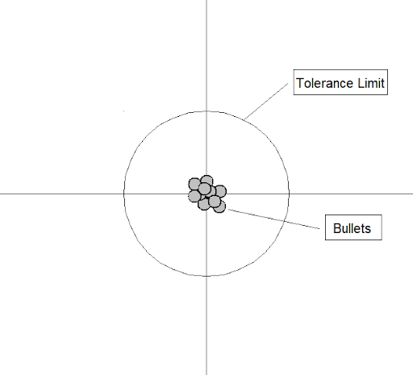
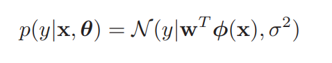

# Linear regression model

Summary: This project focuses on supervised learning, particularly linear models, regularization techniques, overfitting, underfitting, and metrics for quality estimation.

💡 [Tap here](https://new.oprosso.net/p/4cb31ec3f47a4596bc758ea1861fb624) **to leave your feedback on the project**. It's anonymous and will help our team make your educational experience better. We recommend completing the survey immediately after the project.

## Contents

1. [Chapter I. Preamble](#chapter-i-preamble)
2. [Chapter II. Introduction](#chapter-ii-introduction) \
    2.1. [Regression problem](#regression-problem) \
    2.2. [Linear regression](#linear-regression) \
    2.3. [Gradient Descent](#gradient-descent) \
    2.4. [Overfitting and underfitting](#overfitting-and-underfitting) \
    2.5. [Quality metrics](#quality-metrics) \
    2.6. [Alternative linear regression problem formulation](#alternative-linear-regression-problem-formulation)
3. [Chapter III. Goal](#chapter-iii-goal) 
4. [Chapter IV. Instructions](#chapter-iv-instructions)
5. [Chapter V. Task](#chapter-v-task)

## Chapter I. Preamble

In the last project we discussed what ML is and what problems this field of science solves. And also a detailed series of examples of the most difficult tasks and by what group they can be divided. The goal of the open project is one of this group and will get acquainted with the first child — a linear model.

But before we start, I would like to briefly describe how they usually approach the description of all tools. Then we will look at the formulation of the problem from a mathematical point of view. And the main tool for solving these statements will be the following algorithm:

We limit the pool of possible solutions to a certain set (set of functions).

For example, we want to predict temperature y from pressure x with only 1 observation. We limit ourselves to the set of linear functions:

$$y \approx \hat{y}=f(x)=wx$$

Usually, each solution in this set can be uniquely determined by parameters. In our example, this is the parameter *a*.

We choose a loss function that clearly demonstrates our desire to find a solution that satisfies the objective of the problem.

In our example, this is the standard deviation, which takes on high values when our prediction is far from the true value.

$$L \left( y, \hat{y} \right) = \left( y - \hat{y} \right)^2$$

Thus, the search for our optimal solution is reduced to finding a solution for which the loss function is minimal. However, since the function will depend on the parameter, we can say that the goal is to find such parameters for which the loss function is minimal.

In our example, the formal problem will look like this:

$$\arg \min_{\hat{y}} L \left( y, \hat{y} \right) = \arg \min_{w} L(y, wx)$$

The fact that the loss function depends on the parameters allows us to use derivatives and optimization methods (including gradient descent) to find the optimal values for the parameters.

In our example:

$$\frac{\partial L}{\partial w}=-2w(y-wx)=0 \Rightarrow w=\lbrace \frac{y}{x}, 0 \rbrace$$

Often it will be possible to look at the same problem mathematically from a different angle by solving it in an alternative formulation. This will open up new meanings in the solution that will help you better understand the the details even better. Therefore, we strongly recommend that you do not dwell on the materials mentioned in this course, and periodically improve your understanding of one approach or another.

In this chapter, we will discuss regression problems that limit the pool of possible solutions with linear models. Along with the model itself, we consider things closely related to the model development process: definitions of overfitting/underfitting, how to deal with them, and how to estimate the quality of models.

## Chapter II. Introduction

### Regression problem

Suppose we have a set of inputs *X* that correspond to outputs *y*. The goal is to find a mapping function f from *X* to *y*. In regression problems, $`y ∈ R`$ and our $`X ∈ R^n`$. In other words:

$$f: X \rightarrow y, \text{ where } y \in \mathbb{R} \text{ is a target, } X \text{ is training data }$$

There are many examples of real-world regression problems. Let's look at the most popular ones:
* Predicting the age of a viewer watching TV or video channels.
* Predicting the amplitude, frequency, and other characteristics of a heartbeat.
* Predicting the amount of taxis required due to certain weather conditions.
* Predicting the temperature at any location inside a building using weather data, time, door sensors, etc.

In the case of linear regression, the key property is that the expected value of the output is assumed to be a linear function of the input. function of the input, $$f(\mathbf{x}) = \mathbf{w}^T \mathbf{x} + b$$ . This makes the model easy to fit to the data and easy to interpret. 

For regression, the most common choice is to use quadratic loss, or $`l2`$ loss, or MSE — mean squared error:

$$l_2 \left(y, \hat{y} \right) = \left( y - \hat{y} \right)^2$$

where $`\hat y`$ is the estimate of the model. We use loss to minimize error and to fit the model. Let's dive into the linear regression model.

### Linear Regression

One of the most widely used, but not always effective, algorithms for solving regression problems is the linear regression model. The main goal of this model is to estimate the linear function of the training set with the least error.

We can fit this data with a simple linear regression model of the form:

$$f(x;\boldsymbol{\theta}) = b + \mathbf{w} x$$

where $$\mathbf{w}$$ is the slope, $$b$$ is the offset (or bias), and $$\boldsymbol{\theta} = (\mathbf{w}, b)$$ are all parameters of the model. By adjusting $$\boldsymbol{\theta}$$, we can minimize the sum of squared errors until we find the least squares solution:

$$\hat{\boldsymbol{\theta}} = \arg \min_{\boldsymbol{\theta}} \text{MSE}(\boldsymbol{\theta})$$

$$\text{MSE}(\boldsymbol{\theta}) = \frac{1}{N}\sum_{n=1}^{N} \left( y_n - f(x_n; \boldsymbol{\theta})\right)^2$$

where MSE is mean squared error.

Lets deep with formal way, linear regression model could be wrote as:

$$f(x;\boldsymbol{\theta}) = \mathbf{w}^T \mathbf{x} + b + \epsilon = \sum_{i=1}^D w_i x_i + b + \epsilon$$

where $$ \mathbf{w}^T \mathbf{x}$$ is the inner or scalar product between the input vector $$\mathbf{x}$$ and the model's weight vector $$\mathbf{w}$$, $$b$$ is the offset (or bias), and $$\epsilon$$ is the residual error between our linear predictions and the true response.

Mathematically, we can define our task as minimizing the MSE. To solve these problems, we can use optimization methods like gradient descent or Newton's method or even write down an analytical solution that involves matrix inversion (after you complete your first task, which we will discuss later in this chapter — you will find that matrix inversion is a heavy computational operation). Your first task will be to find an analytical solution to the regression problem.

### Gradient Descent

It is a common fact that the gradient is the direction of the fastest increase of the function value, and in the opposite case the anti-gradient is the direction of the fastest decrease. Thus, gradient descent is about finding a local minimum of a differentiable function. And since our main goal in almost any machine learning task is to reduce the value of the loss function, gradient descent is perfectly suited for this need.

To do this, we should iteratively repeat the next steps:

1. Calculate the value of gradient

    $$\frac{\partial L}{\partial \boldsymbol{\theta}} = \nabla L = \left( \begin{array}{c} \frac{\partial L}{\partial \theta_1} \\ \dots \\ \frac{\partial L}{\partial \theta_n} \end{array} \right)$$

2. Update parameter values using formula:

    $$\boldsymbol{\theta}^{i+1} = \boldsymbol{\theta}^i - \gamma \nabla L \left( \boldsymbol{\theta}^i \right)$$
    
    Where $$\gamma$$ is the learning rate that defines how far we should go and where 0 is usually defined randomly.

There are many modifications of gradient descent for more accurate results and faster computation. 
We consider the primary modification — stochastic gradient descent. Strength of this method is that we stochastically choose an object (or a set of objects) and calculate gradient only on this object. It helps to save a lot of time, but qualitative efficiency doesn't have huge dropdowns. 

We recommend that you read about other modifications of GD such as Adagrad, RMSProp, Adam and Momentum methods, also you can read about secondary order methods such as Newton's method.

### Overfitting and underfitting

A fundamental problem with MLE is that it tries to choose parameters that minimize loss on the training set, but this may not result in a model that has low loss on future data. This is called overfitting.

Therefore, when fitting highly flexible models, we must be careful not to overfit the data, i.e., we should avoid trying to model every small variation in the input, as this is more likely to be noise than true signal. 

This is illustrated in the figure below, where we see that using a high degree polynomial results in a curve that is very "wiggly". The true function is unlikely to have such extreme fluctuations. Therefore, using such a model could result in accurate predictions of future outputs.

An underfit model is the opposite of an overfit model — the model that does not learn any dependencies from the training data set, or learns them in the wrong way. This again results in poor performance on the test dataset. For example, we need to classify handwritten digits, and it happens that all images of 8's have 67 dark pixels, while all other examples don't. 

The model might decide to exploit this random regularity, and thus correctly classify all training examples of 8s, without learning the true regularities. And when we pass some new images of 8's, written with the other scale, we get very poor performance, because the number of dark pixels will be different. The model does not learn the necessary patterns.

In other words, we need to adjust the model to balance between these 2 cases. This is also known as bias-variance tradeoff. The error we produce when fitting and evaluating the model can be divided into 2 parts (actually 3, but we can't influence the third): bias and variance. To understand what each type of error means, see the figure from [Wikipedia](https://en.wikipedia.org/wiki/Bias%E2%80%93variance_tradeoff):

> By Bernhard Thiery — Own work, CC BY-SA 3.0

* "The bias error is an error due to incorrect assumptions in the learning algorithm. High bias can cause an algorithm to miss the relevant relations between features and target outputs (underfitting)."
* “The variance is an error from sensitivity to small fluctuations in the training set. High variance can cause an algorithm to model the random noise in the training data (overfitting)."

Hopefully, most models in machine learning deal with bias error and could have problems mainly with variance. But there are many special techniques to reduce model overfitting. Here we want to introduce one of them, which is called regularization. 

### Regularization

Usually, regularization comes from the fact that it simply consumes the additive in the loss function, which depends on the parameters of the model.

$$\min_{\boldsymbol{\theta}} \sum_{i=1}^N L \left( f(x_i, \boldsymbol{\theta}), y_i \right) + \lambda R(\boldsymbol{\theta})$$

The idea of this addition is that the models do not try to learn complex patterns and try to find the solution. In other words, if the model starts to overfit in the process of finding a solution, then the addition in the in the error function will begin to increase, forcing the model to stop training.

For linear regression, 2 variants of these additions are usually used:
* L2 — then the linear model is called Ridge model 

    $$R(\boldsymbol{\theta}) = \| \boldsymbol{\theta}\|_2^2 = \sum_{i=1}^d \theta_i^2$$

* L1 — then the linear model is called Lasso model

    $$R(\boldsymbol{\theta}) = \| \boldsymbol{\theta}\|_1 = \sum_{i=1}^d |\theta_i|$$

* Sklearn has also a separate class when these 2 regularizations are combined and such a model is called Elastic

Think about how the algorithm will changes for finding a solution for a linear model if you add L1 and L2 regularization to the loss function. Provide an answer inside your project.

### Quality metrics

Let us dive into quality metrics for estimating regression problems. We have already learned about mean square error. And after researching the definition of ℓ1 regularization, you already know what mean absolute error is. But this metric is not relative. What does that mean?

Let's say we're solving a customer income problem, so our target variable is continuous. And the MAE of our model is 5000. How can we estimate if our model is good enough?

Take a break and think for a few minutes. Here we will discuss a few ways to solve this problem. The first and simplest is to compare our model with native forecasts. For example, we could find the mean of our target variable and set it as the prediction for a test sample for a whole set of customers. Finally, compare the MAE of our model and the native prediction. Here we recommend finding the best native prediction for MSE and MAE. Also think about how we could improve the native prediction for better quality. 

The second way we will discuss here is to convert relative metrics to absolute metrics. The Mean Absolute Percentage Error (MAPE) is one of the widely used regressive problem metrics. MAPE is the sum of the individual absolute errors divided by the demand (each period separately). It is the average of the percentage errors. Compared to MAE, MAPE has an exact range. For better understanding, consider some examples and measure different metrics, also we recommend to define MSLE and R squared coefficient.

### Alternative linear regression problem formulation

Let us look at linear regression from the probability point of view and we can rewrite the model with the connection between linear regression and Gaussians in the following form:

where $`N(µ, \sigma^2)`$ is a **Gaussian** or **normal** distribution with µ being the **mean** and $`\sigma^2`$ being the **variance**.

This makes it clear that the model is a **conditional probability density function**. In the simplest case, we assume that µ is a linear function of *x*, so $`µ= w^Tx`$, and that the noise is fixed, $`\sigma^2(x) = \sigma^2`$.

In this case, $`\theta = (w,\sigma^2)`$ are the **parameters** of the model. 

For example, suppose the input is 1-dimensional. We can write the expected response as:

$`µ(x)= w_0+ w_1x = w^Tx`$

where $`w_0`$ is the intercept or bias term, $`w_1`$ is the slope, and we have defined the vector *x = (1, x)*.

Let's try to figure out how to determine the parameters of the linear regression model.

A common way to estimate the parameters of a statistical model is to compute MLE — Maximum Likelihood Estimation. 
MLE is a method for estimating an unknown parameter by maximizing a Likelihood function, which we can define as:

$`\hat \theta = arg \max\limits_{\theta} L(\theta) = arg \max\limits_{\theta} \prod_{i=1}^l P(y_i|x_i, \theta)`$

where $`L(\theta)`$ — Likelihood function.

It is common to assume that the training examples are independent and identically distributed. This means that we can write the log likelihood as follows:

Instead of maximizing the log likelihood, we can equivalently minimize the negative log likelihood or NLL:

The NLL formulation is sometimes more convenient because many optimization software packages are designed to find the 
to find the minima of functions rather than the maxima. Now let us apply the MLE method to linear regression setting. Substituting the definition of Gaussian into the above, we find that the log likelihood is given by:

RSS stands for residual sum of squares and is given by:

The RSS is also called the sum of squared errors, or SSE, and SSE/N is called the mean squared error, or MSE. It can also be written as the square of the ℓ2 norm of the vector of residual errors:

Linear regression can be made to model nonlinear relationships by replacing x with a nonlinear function of the inputs, φ(x). That is, we use

where could be degrees of features:

Maximum likelihood estimation can lead to overfitting. In some cases, our task — minimizing RSS — could have infinite solutions. Can you give us some examples of such cases? Take a break and think. Answer: well, several common cases for this problem — high correlation features and cases when dimension of features is more than dimension of object. Then there are problems with the huge value of weights and overfitting. To solve this problem, we can add regularization parameters to our minimization equation. There are two basic regularization parameters, ℓ2 and ℓ1. 

$`l2 = ||w||_2 = \sum_{l=1}^d w_i^2`$  
$`l1 = ||w||_1 = \sum_{l=1}^d |w_i|`$

From a probability point of view, we can define the regularization by MAP (Maximum A Posterior estimate) estimation with a zero-mean Gaussian prior on the weights, 

This is called ridge regression. More specifically, we compute the MAP estimate as follows: 

> Source: [Kevin Murphy, Probabilistic Machine Learning: An Introduction](https://probml.github.io/pml-book/book1.html)

is the ℓ2 norm of the vector w. Thus, we penalize weights that become too large. In general, this technique is called ℓ2 regularization or weight decay, and is widely used.

## Chapter III. Goal

The goal of this task is to gain a deep understanding of linear models for regression. 

## Chapter IV. Instructions

* This project will be graded by humans only. You are free to organize and name your files as you wish.
* We use Python 3 as the only correct version of Python.
* For training deep learning algorithms, you can try [Google Colab](https://colab.research.google.com). It provides kernels (runtime) with GPU for free, which is faster than CPU for such tasks.
* The standard does not apply to this project. However, you are asked to be clear and structured in your source code design.
* Store the datasets in the data subfolder.

## Chapter V. Task

We will continue our practice with a problem from Kaggle.com. In this chapter, we will implement Implement all the models described above. Measure quality metrics on training and test parts. Detect and regularize overfitted models. And dive deeper with native model estimation and comparison.

1. Answer the questions
   1. Derive an analytical solution to the regression problem. Use a vector form of the equation.
   2. What changes in the solution when L1 and L2 regularizations are added to the loss function.
   3. Explain why L1 regularization is often used to select features. Why are there many weights equal to 0 after the model is fit?
   4. Explain how you can use the same models (Linear regression, Ridge, etc.) but make it possible to fit nonlinear dependencies.

2. Introduction — make all the preprocessing staff from the previous lesson
   1. Import libraries. 
   2. Read Train and Test Parts.
   3. Preprocess "Interest Level" feature.

3. Intro data analysis part 2
   1. Let's generate additional features for better model quality. Consider a column called "Features". It consists of a list of highlights of the current flat. 
   2. Remove unused symbols ([,], ', ", and space) from the column.
   3. Split values in each row with the separator "," and collect the result in one huge list for the whole dataset. You can use DataFrame.iterrows().
   4. How many unique values does a result list contain?
   5. Let's get acquainted with the new library — Collections. With this package you could effectively get quantity statistics about your data. 
   6. Count the most popular functions from our huge list and take the top 20 for this moment.
   7. If everything is correct, you should get next values:  'Elevator', 'HardwoodFloors', 'CatsAllowed', 'DogsAllowed', 'Doorman', 'Dishwasher', 'NoFee', 'LaundryinBuilding', 'FitnessCenter', 'Pre-War', 'LaundryinUnit', 'RoofDeck', 'OutdoorSpace', 'DiningRoom', 'HighSpeedInternet', 'Balcony', 'SwimmingPool', 'LaundryInBuilding', 'NewConstruction', 'Terrace'.
   8. Now create 20 new features based on the top 20 values: 1 if the value is in the "Feature" column, otherwise 0.
   9. Extend our feature set with 'bathrooms', 'bedrooms', 'interest_level' and create a special variable feature_list with all feature names. Now we have 23 values. All models should be trained on these 23 features.

4. Models implementation — Linear regression
   1. Implement a Python class for a linear regression algorithm with two basic methods — fit and predict. Use stochastic gradient descent to find optimal model weights. For better understanding, we recommend implementing separate versions of the algorithm with the analytical solution and non-stochastic gradient descent under the hood.
   2. Define the R squared (R2) coefficient and implement a function to calculate it.
   3. Make predictions with your algorithm and estimate the model with MAE, RMSE and R2 metrics.
   4. Initialize LinearRegression() from sklearn.linear_model, fit the model, and predict the training and test parts as in the previous lesson.
   5. Compare the quality metrics and make sure the difference is small (between your implementations and sklearn).
   6. Store the metrics as in the previous lesson in a table with columns model, train, test for MAE table, RMSE table, and R2 coefficient.

5. Regularized models implementation — Ridge, Lasso, ElasticNet    
   1. Implement Ridge, Lasso, ElasticNet algorithms: extend the loss function with L2, L1 and both regularizations accordingly.
   2. Make predictions with your algorithm and estimate the model with MAE, RMSE and R2 metrics.
   3. Initialize Ridge(), Lasso(), and ElasticNet() from sklearn.linear_model, fit the model, and make predictions for the training and test samples as in the previous lesson.
   4. Compare quality metrics and make sure the difference is small (between your implementations and sklearn).
   5. Store the metrics as in the previous lesson in a table with columns model, train, test for MAE table, RMSE table, and R2 coefficient.
   
6. Feature normalization
   1. First, write several examples of why and where feature normalization is mandatory and vice versa.
   2. Let's consider the first of the classical normalization methods — MinMaxScaler. Write a mathematical formula for this method.
   3. Implement your own function for MinMaxScaler feature normalization.
   4. Initialize MinMaxScaler() from sklearn.preprocessing.
   5. Compare the feature normalization with your own method and with sklearn.
   6. Repeat the steps from b to e for another normalization method StandardScaler.

7. Fit models with normalization
   1. Fit all models — Linear Regression, Ridge, Lasso, and ElasticNet — with MinMaxScaler.
   2. Fit all models — Linear Regression, Ridge, Lasso, and ElasticNet — with StandardScaler.
   3. Add all results to our dataframe with metrics on samples.

8. Overfit models
   1. Let's look at an overfitted model in practice. From theory, you know that polynomial regression is easy to overfit. So let's create a toy example and see how regularization works in real life.
   2. In the previous lesson, we created polynomial features with degree 10. Here we repeat these steps from the previous lesson, remembering that we have only 3 basic features — 'bathrooms', 'bedrooms', ''interest_level'.
   3. And train and fit all our implemented algorithms — Linear Regression, Ridge, Lasso, and ElasticNet — on a set of polynomial features.
   4. Store the results of the quality metrics in the result dataframe.
   5. Analyze the results and select the best model according to your opinion.
   6. Additionally try different alpha parameters of regularization in algorithms, choose the best one and analyze results.

9. Native models
   1. Calculate the mean and median metrics from the previous lesson and add the results to the final dataframe.

10. Compare results
    1. Print your final tables
    2. What is the best model?
    3. Which is the most stable model?

11. Addition task
    1. There are some tricks with the target variable for better model quality. If we have a distribution with a heavy tail, you can use a monotone function to "improve" the distribution. In practice, you can use logarithmic functions. We recommend that you do this exercise and compare the results. But don't forget to do the inverse transformation if you want to compare metrics.
    2. The next trick is outliers. The angle of the linear regression line depends strongly on outliers. And often you should remove these points from !allert! only training data. You should explain why they were removed from the training sample only.  We recommend that you do this exercise and compare the results.
    3. It will also be a useful exercise to implement a linear regression algorithm with batch training.

### Submission

Save your code in Python JupyterNotebook. Your peer will load it and compare it with the basic solution. Your code should include answers to all mandatory questions. The additional task is up to you. 

>Please leave feedback on the project in the [feedback form.](https://forms.yandex.ru/cloud/646b4693e010db2a75f1f5e6/) 
