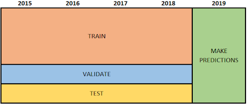
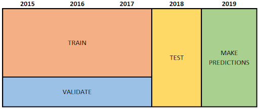
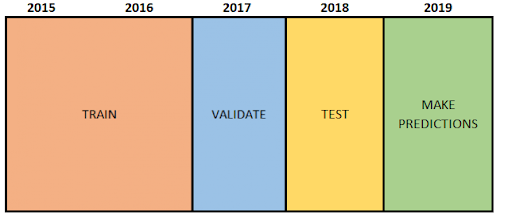
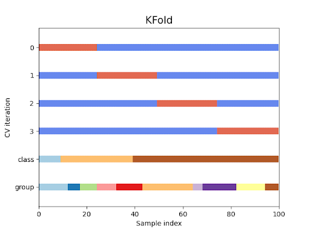
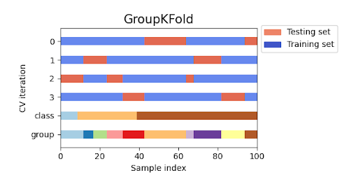
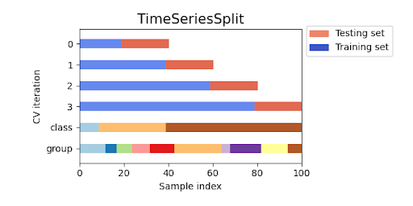
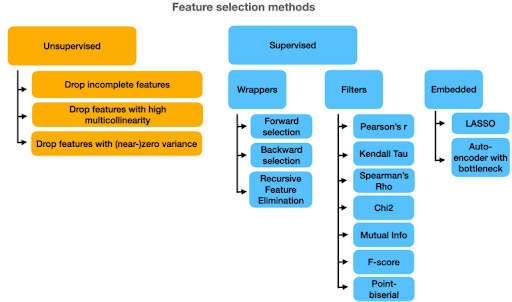

# Model quality estimation

Summary: This project discusses different validation techniques. We will discuss how to correctly measure model quality and avoid leaks. We also consider several ways to optimize model hyperparameters and various methods of feature selection.

💡 [Tap here](https://new.oprosso.net/p/4cb31ec3f47a4596bc758ea1861fb624) **to leave your feedback on the project**. It's anonymous and will help our team make your educational experience better. We recommend completing the survey immediately after the project.

## Contents

1. [Chapter I. Preamble](#chapter-i-preamble)
2. [Chapter II. Introduction](#chapter-ii-introduction) \
    2.1. [One fold validation](#one-fold-validation) \
    2.2. [Cross-validation (N folds validation)](#cross-validation-n-folds-validation) \
    2.3. [Hyperparameter optimization](#hyperparameter-optimization) \
    2.4. [Feature selection](#feature-selection)
3. [Chapter III. Goal](#chapter-iii-goal) 
4. [Chapter IV. Instructions](#chapter-iv-instructions)
5. [Chapter V. Task](#chapter-v-task)

## Chapter I. Preamble

In previous projects, we looked at many different examples of machine learning applications and dove into building linear regression models. But we always had prepared training and test samples. In this project, we will discuss how to split the dataset into parts in order to fit the models correctly.

The validation process is probably one of the most difficult and important parts of the modeling pipeline. Look at a few examples: let's imagine that you are a huge food retail company. And from the beginning of summer, you have the task of forecasting ice cream sales for the next 3 months. You have collected data from the last half of the year. You use the last three available months for the test set. But 3 summer months, which we cannot currently observe, 3 spring months, and 3 winter months from the available data will have different natures. Everyone knows that ice cream sales decrease in cold months.

Let's consider a more complex example. We need to predict loan defaults in a bank. This is a common task in practice. If we group our training and test samples in this task by an identifier of the loan application, we will make a big mistake. Why is that? A customer might ask the bank for a loan more than once. And it could happen that a customer's loan from 2020 will be in the training part, while the same customer's loan from 2018 will be in the test part. This means that the trained model will already know that the client has repaid the loan from 2018. Of course, this knowledge isn't built directly into the model, but it's very likely that this information is stored in features. This allows the model to learn misleading patterns and leads to underfitting. 
This situation is commonly referred to as information leakage.

And that is not all. Remember that in the previous project we selected special features for our models? What if we want to try different possible subsets and choose the best one that does not contain redundant features? Or you may also notice that when we add regularization to the loss, it contains the weight that we multiply on. This weight also affects the performance of the model. So how should we optimize it? Spoiler, for such needs we should also split our dataset into the validation part, i.e. into training, valid and test parts.

So the main goal for the validation process is to find the best way to wrap the training and testing process in such a way that it doesn't add any errors to the model while it's working in production. Let's look at validation techniques.

## Chapter II. Introduction

### One fold validation

It is a clear idea to split our data into two parts — training and test set. But there are many ways to do it. The first and simplest way is a random split by some identifier with a fixed ratio of train/test set. For example, a random split by the index of the sample dataset or by the user's identifier that corresponds to a single sample in our dataset. It is a widely used method for those cases when you have a lot of data and **data have no time relationship**. In this case, the test part is often called out-of-fold. Fold here is the synonym for "part of the dataset". So "out-of-fold" means that we check the performance on the samples that are not from the part we use for training.

The second way to split the dataset into 2 samples is to sort our data by time or date and take some of the last period as a test. Be careful with the above example. Obviously, this method could be used if you have time relationships in the data. In this case, our splitting method is called out-of-time.

In practice, two folds — training and testing — are not enough. Later in this chapter, we will consider parts of the modeling pipeline, such as feature selection and hyperparameter optimization, that require a special fold for model quality estimation, and this set is called the validation set. It could be a fold that we create from the train using an out-of-fold or out-of-time strategy. Important that:
* On the training part of the dataset we train our model.
* On the validation part of the dataset, we measure the quality of the trained model and tune its performance by varying different conditions of the preprocessed data or by varying the hyperparameters of the model.
* On the test part of the dataset, we measure the final quality of our model to understand the real profit of our model.

So, you cannot use test data in the modeling pipeline except for the final metric measurement.

Below we visualize the splitting process into training, validation and test. 

Classic approach

Out-of-time for test part

Out-of-time both for test and valid parts

Source: https://muse.union.edu/dvorakt/train-validate-and-test-with-time-series/

As we see above, we could combine these methods. But what if we do not have that much data to model, how do we avoid overfitting?

### Cross-validation (N Fold Validation)

In practice, we could find many problems where we cannot collect much data for model training, for example medical problems where data collection is expensive and complex. 

For these cases, we could use a cross-validation scheme. First, we split our data into N folds. Second, we take the first fold and use it as the test part, while we use the other folds to train our model. Then we repeat this process for the next fold, and so on. Finally, we need to collect metrics from all the folds and take an average to evaluate the model performance. The most common number of folds is in the range of 3 to 10. 

See the figure below for a deeper understanding:

Source: https://scikit-learn.org/stable/modules/cross_validation.html

There is a special case of cross-validation called a leave-one-out validation scheme. It will be a task for you — find definition for this scheme and give limitations and strong sides.

In sklearn, there are several special methods for cross-validation: K-fold, grouped K-fold, stratified K-fold and TimeSeriesSplit. Let's dive into them to understand the differences.

**K-Fold** repeats what we described above. Blue is the training set and red is the test. To get the performance, we train and evaluate our model on 4 different splits and then take the average score. Alternatively, for each red piece we can remember the prediction of the corresponding model. If we combine these predictions we get the vector called out-of-fold predictions. Thus, we can compute our performance metric by passing out-of-fold predictions and true labels to the function. 

Why do we mention this alternative? Because out-of-fold may be useful for improving model performance, but this topic is beyond the scope of this project. If you want to dive deeper, read about stacking.

The K-Fold method has a strong weakness when the data has observations of a common group. The group here can be any important property that you think the data should be split into. It could be observations from a customer at different times, or IDs from different aircraft where you need to detect breaks. In these cases, we need to split train-test samples into parts in such a way that a client/airplane will only be in train or test sample — it couldn't be intersections for client ID in train and test sets. 

This method is called **Group K-Fold**. As before, we split our sample into K-Folds, but we also grouped it by special parameter. Below you can see the visualization for group K-Fold by "group" column.

There are a few more interesting and important branches for cross-validation schemes. They are called **Stratified K-Fold** and **Stratified Group K-Fold**. It is a task for you to give some examples where we need to stratify the target variables by the folds. Give us strong and weak sides of these methods.

Now we consider the last cross-validation scheme when data has a time relationship. It is called time series splitting. First of all, we need to sort our data by date or specified timeline. Define k — it will be the number of splits.

For the first model, we take 1/k of the data for the training sample and then 1/k for the test sample. For the second model, we expand the training sample to 2/k of the data and move the sliding window to the next 1/k for the test. And so on. In this method, we train k-1 models instead of k models.

### Hyperparameter optimization

In this part we would discuss hyperparameter optimization — it is the process of finding the best combination of model parameters for better performance and less overfitting. There are 2 types of model parameters — internal — model optimizes these parameters by itself during fitting, and external — which are not updated during fitting (we don't update them with gradient or any other way). Such external parameters are called hyperparameters, and here we will talk only about them. Try to give some examples for both types of parameters.

Hyperparameter optimization is a loop process. You change one or more model params, fit the model to the training set and measure the quality on the validation set, and if the metrics increase, you go on in that direction, and if they do not, you try to change them. 

Sometimes clear logic will help you choose appropriate hyperparameters to optimize. For example, let's say we have polynomial regression as a base algorithm. And we have a large gap between the metrics on the train and the validation set. So we conclude that our model is overfitted. Clear logic suggests us to reduce the degree of polynomial features — the number of them is the hyperparameter in this case. But how to find an optimal set of 5 or 10 independent hyperparameters?

Unfortunately, there is almost nothing better than to check all meaningful combinations of hyperparameters. This method is called Grid Search. But it takes a lot of time. If we have a limited amount of time, we can use Randomized Grid Search. Understanding how they work is part of your assignment.

But both of these approaches have a weakness — they do not consider relationships in the parameters. If we fit 3 models with the same degree of polynomial features, vary other hyperparameters, and get poor performance? How likely is it that we should try a different degree? The idea that solves this is applied in the Bayesian optimization. 

There are two libraries in Python that implement the solution: hyperopt and optuna (optuna seems to be better). Explaining what math is under the hood of this approach is also part of your task.

### Feature selection

The next important step in the modeling process, which can also be thought of as hyperparameter optimization, is feature selection. Often we have thousands of features from raw data sources, and we could also generate a huge amount of them. It is an obvious question how to find more important features that have signal and remove noisy and garbage columns. As a result, we can not only speed up the model, but also increase the performance. But how to do this?

The same as with hyperparameters, we could brute force all possible combinations of features and find the optimum, but it will take too much time. Fortunately, compared to hyperparameter tuning, there are many approaches to feature selection. To understand them all, it is better to use some classification:

Source: https://neptune.ai/blog/feature-selection-methods (this list is not complete and the classification may not be that perfect).

The division between supervised and unsupervised is the same as in machine learning tasks. Understanding the difference between wrappers, filters, and embedded is your task in this project. Please make sure you are familiar with:
* All unsupervised techniques;
* All wrapper methods;
* Filters:
  * Pearson,
  * Chi2;
* Embedded: 
  * Lasso,
  * Ridge.
* The following methods would fall somewhere between wrappers and filters, and are not shown in the figure above. But these methods are very recommended:
  * **permutation importance**;
  * **shap** — https://shap.readthedocs.io/en/latest/.

The last thing we want to note before the practice is that both hyperparameter optimization and feature selection can be combined with cross-validation. It will help to make these processes fair and not to let models overfit.

## Chapter III. Goal

The goal of this task is to get a deep understanding of the schemes of validation, hyperparameter optimization, and feature selection. 

## Chapter IV. Instructions

* This project will be evaluated by humans only. You are free to organize and name your files as you wish.
* Here and further we use Python 3 as the only correct version of Python.
* For training deep learning algorithms you can try [Google Colab](https://colab.research.google.com). It offers free kernels (Runtime) with GPU, which is faster than CPU for such tasks.
* The standard does not apply to this project. However, you are asked to be clear and structured in your source code design.
* Store the datasets in the data subfolder.

## Chapter V. Task

We will continue our training with a problem from Kaggle.com. 
In this chapter, we will implement all the validation schemes, some hyperparameter tuning methods, and feature selection methods described above. Measure quality metrics on training and test samples. Will detect overfitted models and regularize them. And dive deeper with native model estimation and comparison.
1. Answer the questions from the introduction
   1. What is leave-one-out? Provide limitations and strengths.
   2. How do Grid Search, Randomized Grid Search, and Bayesian optimization work?
   3. Explain classification of feature selection methods. Explain how Pearson and Chi2 work. Explain how Lasso works. Explain what permutation significance is. Become familiar with SHAP.

2. Introduction — do all the preprocessing from the previous lesson
   1. Read all the data.
   2. Preprocess the "Interest Level" feature.
   3. Create features:  'Elevator', 'HardwoodFloors', 'CatsAllowed', 'DogsAllowed', 'Doorman', 'Dishwasher', 'NoFee', 'LaundryinBuilding', 'FitnessCenter', 'Pre-War', 'LaundryInUnit', 'RoofDeck', 'OutdoorSpace', 'DiningRoom', 'HighSpeedInternet', 'Balcony', 'SwimmingPool', 'LaundryInBuilding', 'NewConstruction', 'Terrace'.

3. Implement the next methods:
   1. Split data into 2 parts randomly with parameter test_size (ratio from 0 to 1), return training and test samples.
   2. Randomly split data into 3 parts with parameters validation_size and test_size, return train, validation and test samples.
   3. Split data into 2 parts with parameter date_split, return train and test samples split by date_split param.
   4. Split data into 3 parts with parameters validation_date and test_date, return train, validation and test samples split by input params.

4. Implement the next cross-validation methods:
   1. K-Fold, where k is the input parameter, returns a list of train and test indices. 
   2. Grouped K-Fold, where k and group_field are input parameters, returns list of train and test indices. 
   3. Stratified K-fold, where k and stratify_field are input parameters, returns list of train and test indices.
   4. Time series split, where k and date_field are input parameters, returns list of train and test indices.
 
5. Cross-validation comparison
   1. Apply all the validation methods implemented above to our dataset.
   2. Apply the appropriate methods from sklearn.
   3. Compare the resulting feature distributions for the training part of the dataset between sklearn and your implementation.
   4. Compare all validation schemes. Choose the best one. Explain your choice.

6. Feature Selection
   1. Fit a Lasso regression model with normalized features. Use your method for splitting samples into 3 parts by field created with 60/20/20 ratio — train/validation/test.
   2. Sort features by weight coefficients from model, fit model to top 10 features and compare quality.
   3. Implement method for simple feature selection by nan-ratio in feature and correlation. Apply this method to feature set and take top 10 features, refit model and measure quality.
   4. Implement permutation importance method and take top 10 features, refit model and measure quality.
   5. Import Shap and also refit model on top 10 features.
   6. Compare the quality of these methods for different aspects — speed, metrics and stability.

7. Hyperparameter optimization
   1. Implement grid search and random search methods for alpha and l1_ratio for sklearn's ElasticNet model.
   2. Find the best combination of model hyperparameters.
   3. Fit the resulting model.
   4. Import optuna and configure the same experiment with ElasticNet.
   5. Estimate metrics and compare approaches.
   6. Run optuna on one of the cross-validation schemes.

### Submission

Save your code in Python JupyterNotebook. Your peer will load it and compare it to the basic solution. Your code should contain answers to all mandatory questions. The additional task is up to you.

>Please leave feedback on the project in the [feedback form.](https://forms.yandex.ru/cloud/646b46f7d046882ee5a0b173/) 
