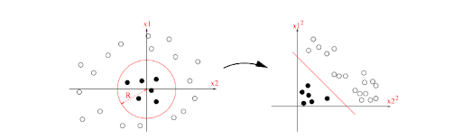
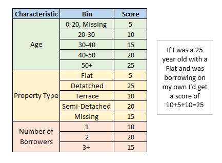
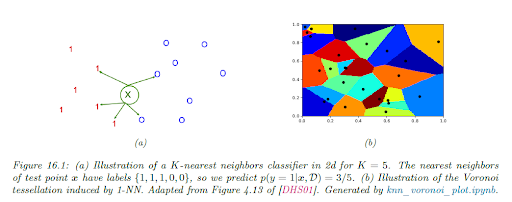
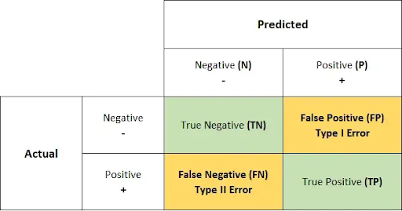

# Supervised Learning. Classification

Summary: this project is an introduction to classification problems and related ML algorithms.

💡 [Tap here](https://new.oprosso.net/p/4cb31ec3f47a4596bc758ea1861fb624) **to leave your feedback on the project**. It's anonymous and will help our team make your educational experience better. We recommend completing the survey immediately after the project.

## Contents

1. [Chapter I. Preamble](#chapter-i-preamble)
2. [Chapter II. Introduction](#chapter-ii-introduction) \
    2.1. [Logistic Regression](#logistic-regression) \
        2.1.1. [Formulation](#formulation) \
        2.1.2. [Limitations and strong sides](#limitations-and-strong-sides) \
    2.2. [Naive Bayes](#naive-bayes) \
        2.2.1. [Formulation](#formulation) \
        2.2.2. [Limitations and strong sides](#limitations-and-strong-sides) \
    2.3. [KNN](#knn) \
        2.3.1. [Formulation](#formulation) \
        2.3.2. [Limitations and strong sides](#limitations-and-strong-sides) \
    2.4. [SVM](#svm)
3. [Chapter III. Goal](#chapter-iii-goal) 
4. [Chapter IV. Instructions](#chapter-iv-instructions)
5. [Chapter V. Task](#chapter-v-task)
6. [Chapter VI. Bonus part](#chapter-vi-bonus-part)

## Chapter I. Preamble

You have already studied regression problems. We can try to predict values such as: human age, stock prices, tomorrow's weather (temperature), etc. But what if we want to predict **categorical** features: if the patient has a certain disease, what are the numbers on the street sign? These kinds of problems are called **classification problems**. They are similar to regression problems, but have a different flavor.

We will consider 3 types of classification models: Logistic Regression (which is some sort of alternation of Linear Regression), Naive Bayes Classifier (model designed specifically for classification problems) and KNN (which can be applied to both regression and classification tasks).


## Chapter II. Introduction

Classification problems are similar to regression problems. In classification problems, the output space is a set of **C** unordered and **mutually exclusive** labels (classes); we want to invent such a function *f*:

$$f: X \rightarrow Y, \text{ where } Y \in \lbrace 1, 2, \dots, C \rbrace, X - \text{ training set}$$
, where _Y__= {1, 2, . . . , C}_, _X_ — training set.

When we have only two classes (when we set $$Y \in \lbrace 0, 1 \rbrace$$), the problem is called **binary classification**. We will focus on binary problems in this lesson.

Real-life examples of binary classification include:
* Whether a patient has a particular disease.
* Whether a given transaction is fraud.
* Predicting whether a customer would click on an advertising banner in a mobile application.
* Predicting whether the price of a particular stock will rise or fall in the next few seconds (useful for trading).
* Predicting whether a customer will pay back a loan (probability of default, PD; useful in banking).

From a probabilistic point of view, a binary classification problem could be seen as estimating the probability that a given instance x has label 1:

$$p(y=1|\mathbf{x}, \boldsymbol{\theta}), \mathbf{x} - \text{instance, } \boldsymbol{\theta} - \text{parameters of the model}$$ - parameters of the model 

Binary problems are just a special case of classification problems (if ***C*** is greater than 2, we call it a **multiclass problem**). Binary problem approaches can be used to solve multiclass problems.  Solve ***C*** different binary problems in a one-vs-all fashion, i.e.: train ***C*** models, where for the binary problem of **i** you define goal as 1 if y = i, and define goal as 0 if y ≠ i. To make a prediction in such a case, we can simply take the *argmax* of the ***C*** received scores:

$$\arg \max_{i \in \lbrace 1, 2, \dots, C \rbrace} p(y=i|\mathbf{x}, \boldsymbol{\theta})$$

Sometimes it is more convenient (for solving business problems) to translate regression-like tasks into binary ones: predicting whether a person has a higher income than the average income in his or her country, or predicting stock price movements (as in the example above). Sometimes classification problems can be transformed into regression problems by ordering the labels. In the definition above, we defined a set of labels C to be unordered, but sometimes it is convenient to solve our task as a classification problem even if our labels are ordered.

### Logistic Regression

#### Formulation

Logistic Regression is model of the following form:

$$p(y=i|\mathbf{x}, \boldsymbol{\theta}) = \sigma (a) = \frac{1}{1 + e^{-a}}, \text{where } a = \mathbf{w}^T \mathbf{x} + b \text{ and } \boldsymbol{\theta} = (\mathbf{w}, b)$$

The function $$\sigma$$ is called **sigmoid**. Logistic Regression is equivalent to linearly combining the features of the matrix ***X*** and adding a bias term ***b***. Sometimes (when doing the math proofs) we include ***b*** and use an additional column of ones in ***X*** representing the bias within the ***w*** vector. To compute the output of the logistic regression for a particular example ***x***, we need to multiply each component of ***x*** by the corresponding component of ***w*** and add the bias number ***b***; then squash your result with the sigmoid function. You can plot the sigmoid function and make sure that its output is between 0 and 1. "Regression" is only part of the name of the algorithm, it has nothing to do with the regression problem.

Logistic Regression is not the best algorithm in terms of accuracy (on average), but it is an interpretable algorithm: it is easy to explain to any manager or user how your model works. There is a simple relationship between the parameters and the data.

How can we decide which parameters $$\boldsymbol{\theta} = (\mathbf{w}, b)$$ to use? There is a convenient way to train models — use Maximum Likelihood Estimation (MLE). We want to find parameters that maximize the probability of getting a given data set ***X*** with ***Y***. This can be formalized as follows:

$$p(y|\mathbf{x}, \boldsymbol{\theta}) = \sigma (a) = \frac{1}{1 + e^{-a}}$$

is equivalent to 

$$p(y|\mathbf{x}, \boldsymbol{\theta}) =\text{Ber}\left(y|\sigma(\mathbf{w}^T \mathbf{x} + b)\right)$$

where Ber is [Bernoulli distribution](https://en.wikipedia.org/wiki/Bernoulli_distribution).

We take the product of the probability density functions for all the different instances in our data set, then take the logarithm (this is correct because we believe that all instances are independent). The resulting function, taken with a negative sign, is called **Negative Log Likelihood (NLL)**. Using MLE in this context means minimizing NLL. The derivation is given as bonus material.

We can use any gradient-based optimization algorithm to find the best parameters to minimize NLL. It is easy to compute the gradient and the Hessian for NLL, and use any gradient-based method that involves gradient and Hessian. You have to derive the NLL gradient by hand (you will need it to solve programming problems). If you get stuck, check out this [book](https://probml.github.io/pml-book/book1.html). One of the best ways to optimize NLL is **Stochastic Gradient Descent (SGD)**, but it is also possible to use second order methods like **Newton's method**. 

Different software implementations suggest different methods to use. For training on thousands or millions of training samples, the SGD algorithm is more suitable than Newton's method (research and find out why). Stochastic Gradient Descent is a powerful method used not only for learning LR models: it is a basic method for optimizing parameters of **Deep Learning** models.

For LR models, we usually use the same preprocessing techniques as for Linear Regression models: scaling, one-hot-encoding for categorical features, etc. For NaN features, you can use imputation with mean/mode value and set an additional feature — flag of NaN or not NaN value in a given feature.

#### Limitations and strengths

Logistic Regression is an interpretable algorithm: this fact makes it attractive for use in industries with strong regulations (e.g. banking) or need for 100% explainability (some scientific fields). The simple form of the model guarantees explainability, but leads to less accurate models. Roughly speaking, you trade the power of the model for its simplicity. Logistic Regression has only

*number-of-numeric-features + number-of-all-categories-in-catl-features + 1*

features, so this algorithm is less likely to overfit (than more complicated algorithms).

But how can we improve the basic logistic model? Logistic Regression is a linear model with only the nonlinear part being the sigmoid activation function. So we will have a hard time trying to fit Logistic Regression to a nonlinear dependence between ***X*** and ***Y***. Geometrically, the Logistic Regression model is a hyperplane in the feature space: it is only able to separate classes in relatively simple cases.

However, we can transform our input ***X*** using nonlinear transformations (formally, it is applying some nonlinear function ***φ*** to ***X***). Sometimes we can solve challenging problems with this particular hack. Look at the picture below:



On the picture below we transform quadratic decision boundary into a linear one by calculating quadratic features:
$`x_1 \rightarrow x_1^2`$ and $`x_2 \rightarrow x_2^2`$

> Source: [Kevin Murphy, Probabilistic Machine Learning: An Introduction](https://probml.github.io/pml-book/book1.html)

Common versions of this trick include
* Logarithms of features (especially features with fat tails).
* Polynomial features.
* Division of features: feature # 1/feature #2.
* **Sin(x)** or **Cos(x)** to catch periodic components.
* Tree-output-like features: comparisons "is feature #1 is greater than the number **k**".

Adding features has drawbacks: on average, more features can lead to more overfitting.

Using complex features makes your final model less interpretable. However, sometimes we can strike a balance between explicability and accuracy. A classic example is credit scores:



> Source: https://www.lancaster.ac.uk/stor-i-student-sites/katie-howgate/2021/02/07/how-to-build-a-credit-scorecard/

Continuous features (like age) are **binned**, it is a non-linear operation, but the final model is easy to explain to anyone, you just need to look at the features and corresponding weights ("scores" on the picture below).

### Naive Bayes

#### Formulation

There is another simple approach to classification problems called the **Naive Bayes Algorithm** (NB algorithm). The core of NB is the following assumption: we assume that all features are conditionally independent given the class label (hence the name Naive). This assumption is too strong to be true in real world scenarios, but often NB classifiers give good results even when the NB assumption is violated.

The main idea of the method is to compute the posterior probability using the Bayes formula:

$$\text{posterior} = \frac{\text{prior} \cdot \text{likelihood}}{\text{evidence}}$$

$$p(y=c|\mathbf{x}) = \frac{p(y=c) p(\mathbf{x}|y=c)}{p(\mathbf{x})} = \frac{p(y=c) p(\mathbf{x}|y=c)}{\sum_{c'} p(y=c') p(\mathbf{x}|y=c')}$$

So our goal will be to Maximize A Posterior (MAP estimation). But if we take a closer look at the denominator, we can understand that it is constant, since the values of the features $$x_i$$ are fixed for the dataset. Moreover, if the NB assumption holds, we can derive the probability of obtaining the feature vector $$\mathbf{x}$$, given that the label _y_ for this vector is equal to the class _c_:

$$p(\mathbf{x} | y=c) =\prod_{d=1}^D p \left( x_d | y=c \right)$$


where $$x_d$$ — feature _d_ for instance $$\mathbf{x}$$.

Combining all statements together, we get that our problem of maximizing the Posterior is equivalent to:

$$p(y=c) p(\mathbf{x}|y=c) \rightarrow \max$$

To use this formula to train the classifier, we need to:

1. specify the form of the probability distributions for the priors;
2. specify the form of the probability distributions of our features;
3. and estimate both.

As for the prior, for classification it is modeled with Bernoulli or multinomial distribution. The good estimate for the class probability in this case would be the proportion of that class in the dataset. As for the distributions of our features:

- We use [Bernoulli distribution](https://en.wikipedia.org/wiki/Bernoulli_distribution) for binary features.
- For continuous features, we can use a normal distribution, or we can make them binary and stick with Bernoulli.
- For categorical features, the Categorical (or Multinomial) [distribution](https://en.wikipedia.org/wiki/Categorical_distribution) is appropriate.

Again, in real-life problems, the distributions of the features may be different from Bernoulli/Multinoulli/Normal, but, as with the NB assumption, sometimes we are still able to train accurate NB classifiers.

Maximum likelihood estimation (MLE) could be used (again) to compute optimal parameters for the NB model. It could be shown (see section 9.3.2 of the [book](https://probml.github.io/pml-book/book1.html)) that learning NB classifiers only involves calculations with simple counts of features (case of binary or categorical features) or square deviations from the mean (case of continuous features). So we don't have any sophisticated optimization procedure, just simple and fast calculations based on training data.

#### Limitations and strengths

Obviously, the NB assumption is a major limitation: NB algorithm has poor quality in most real scenarios. Simplicity of NB training and native way to handle missing values are main advantages of this algorithm.

### KNN

#### Formulation

Both LR and NB models have associated **parameters**. We use data to estimate optimal parameters, after the training phase we can throw away all datasets. Nonparametric models don't have a fixed set of parameters: the effective number of parameters of the model can grow with the size of the dataset. An example of such a model is KNN.

The idea is simple: to classify a new input ***x***, we find the ***K*** closest examples to ***x*** in the training set (using some metric such as L2 or L1 distance), then we average the labels of ***K*** received neighbors to obtain the prediction.



> Source: [Kevin Murphy, Probabilistic Machine Learning: An Introduction](https://probml.github.io/pml-book/book1.html)

There is no optimization: we find nearest neighbors and store them in memory. 

#### Limitations and strengths

The main difficulty of KNN is the choice of the distance metric. L1/L2 are suitable variants when we have homogeneous and continuous data. In other cases, distances between samples are not as informative. Another problem is the dimensionality curse: instances tend to be too far apart when the number of features is large. Training KNN requires a lot of memory, to perform inference we need to keep all our training data.

However, there are different approaches to solve (or at least partially solve) all these problems: there are ways to accelerate training speed, to find better distance metrics, to handle and query training data. Today, KNN is used as a building block for other ML algorithms (e.g. recommender systems).

### SVM

Another model for classification problems — [Support Vector Machines](https://en.wikipedia.org/wiki/Support_vector_machine) (SVMs). SVMs can be linear or non-linear (in other words, have a non-linear kernel). In the linear case, SVM tries to separate classes with a hyperplane, but this hyperplane is constructed in a slightly different way (using *margins*). The non-linear case involves transforming the feature space with *kernels* before constructing the hyperplane to make classes linearly separable.

SVM optimization involves optimization with constraints.

Linear SVM has difficulties with non-linear dependencies, and non-linear SVMs could be seen as a special case of neural networks, so we won't describe SVM in detail here. [This article](https://en.wikipedia.org/wiki/Support_vector_machine) has a good basic description of SVMs.

#### Metrics

The most common loss function used in classification problems is logloss. However, this function is not the best choice as a quality metric for business applications.

There are some commonly used metrics[^1]:
1. Precision/Recall;
2. F1 score;
3. Fbeta Score;
4. AUC PR;
5. AUC ROC.

AUC metrics should be calculated for binary problems, Precision/Recall/F1/Fbeta can be generalized for multiclass setups. We will stick to binary problems for simplicity.

[^1]:  We still use logloss as a minimization for our algorithms when appropriate, but make decisions with the model based on other metrics.

##### Precision/Recall

Precision and recall are metrics for hard labels: not probabilities, but class predictions. Hard labels are obtained from estimated probabilities using thresholding:

$$\mathbb{I}(y=1|x) \> \text{threshold}$$

_ **I** __(p(y = 1|x) \> threshold)_

where $$\mathbb{I}$$ — indicator function (one or zero, based on the underlying statement, one if it is true, zero otherwise).

Hard labels allow us to construct a **confusion matrix**. The definition and details of the confusion matrix are described in this [source](https://en.wikipedia.org/wiki/Confusion_matrix), study it before reading the next paragraph.



> Source: https://medium.com/analytics-vidhya/what-is-a-confusion-matrix-d1c0f8feda5

Precision and recall are defined as

```math
Precision = {tp \over {tp + fp}} \\
Recall = {tp \over {tp + fn}}
```

From the formulas we can derive some interpretations:
* Precision is *what fraction of predicted ones are actually ones*.
* Recall is *what fraction of actual ones are predicted by our model*.

We use combinations of Precision and Recall to validate the quality of your model: one can maximize Recall given a minimum required level of Precision, or vice versa.

For some tasks, Recall is more important than precision:
* Medical cases where further investigation is safe and cheap (you want to detect as many diseases as possible, FP errors result in limited costs/damage;
* Fraud detection;
* Recommending relevant content (online courses, videos, etc.).

In other cases, Precision is preferred over Recall:
* Medicine: in-depth examination or treatment of a disease is too harmful or costly;
* Recommendations for VIP customers (you don't want to bother your best customers with irrelevant recommendations);
* Security systems at airports.

##### F1 Score

Precision and Recall can be combined with appropriate averaging. The harmonic mean of Precision and Recall is called F1 Score.

$`F = 2 \cdot {precision \cdot recall \over {precision + recall}}`$

F1 creates a balance between precision and recall.

##### Fbeta score

If we want to pay more attention to Recall or to Precision, we use Fbeta score, which is generalization of F1 score: 

$`F_{\beta} = (1 + \beta^2) \cdot {precision \cdot recall \over {\beta^2 \cdot precision + recall}}`$

*What parameter value gives more weight to Recall than to Precision?*

##### AUC PR

When optimizing the Fbeta score, we still need to find an optimal threshold. Average Precision (AP) could be seen as a way to aggregate Precision and Recall for all possible thresholds. [Sklearn's documentation](https://scikit-learn.org/stable/modules/generated/sklearn.metrics.average_precision_score.html) gives a good overview of AP.

##### AUC ROC

[This source](https://alexanderdyakonov.wordpress.com/2017/07/28/auc-roc-%D0%BF%D0%BB%D0%BE%D1%89%D0%B0%D0%B4%D1%8C-%D0%BF%D0%BE%D0%B4-%D0%BA%D1%80%D0%B8%D0%B2%D0%BE%D0%B9-%D0%BE%D1%88%D0%B8%D0%B1%D0%BE%D0%BA/) 
has a comprehensive explanation of AUC ROC. AUC ROC can be interpreted as the probability of the following event:

*[predicted probability for random instance of class 0 < predicted probability for random instance of class 1]*.

Note that the base value (random noise score) for the AUC ROC metric is 0.5, not 0!

The **Gini score** can be considered as an "undirected" AUC ROC score and can be calculated using the following formula: *|2\*ROC AUC-1|*

## Chapter III. Goal

The goal of this task is to get a deep understanding of the basic classification models (mainly Logistic Regression, NB and KNN). 

## Chapter IV. Instructions

* This project will be evaluated by humans only. You are free to organize and name your files as you wish.
* Here and further we use Python 3 as the only correct version of Python.
* For training deep learning algorithms you can try [Google Colab](https://colab.research.google.com). It offers free kernels (Runtime) with GPU, which is faster than CPU for such tasks.
* The standard does not apply to this project. However, you are asked to be clear and structured in your source code design.
* Store the datasets in the data subfolder.


## Chapter V. Task

1. Download data from Don’tGetKicked competition. <br/><br/>
2. Design the train/validation/test split. Use the "PurchDate" field for the split, test must be later than validation, same for validation and train: train.PurchDate < valid.PurchDate < test.PurchDate. Use the first 33% of dates for the train, the last 33% of dates for the test, and the middle 33% for the validation set. *Don’t use the test dataset until the end!* <br/><br/>
3. Use LabelEncoder or OneHotEncoder from sklearn to preprocess categorical variables. Be careful with data leakage (fit Encoder to training and apply to validation & test). Consider another coding approach if you encounter new categorical values in validation & test (not seen in training): https://contrib.scikit-learn.org/category_encoders/count.html <br/><br/>
4. Train LogisticRegression, GaussianNB, KNN from sklearn on the training dataset and check the quality of your algorithms on the validation dataset. The dependent variable (IsBadBuy) is binary. Don't forget to normalize your datasets before training your models.
<br/><br/>You must get at least **0.15 Gini score** (the best of all four). Which algorithm performs better? And why?
<br/><br/>
5. Implement Gini score calculation. You can use the 2\*ROC AUC - 1 approach, so you need to implement the ROC AUC calculation. Check if your metric is approximately equal to `abs(2\*sklearn.metrcs.roc_auc_score - 1)`.
<br/><br/>
6. Implement your own versions of LogisticRegression, KNN and NaiveBayes classifiers. For LogisticRegression compute gradients with respect to the loss and use stochastic gradient descent. Can you reproduce the results from step 4?
<br/><br/>Guidance for this task: Your model must be represented by class with methods *fit*, *predict* (*predict_proba* with 0.5 *threshold*), *predict_proba*. For LR moder, compute the loss gradient with respect to parameters **w** and parameter **b** in the fit function. Use a simple SGD approach to estimate optimal values of parameters.<br/><br/>
7. Try to create non-linear features, for example:
<br/><br/>
fractions: feature1/feature2
groupby features: `df[‘categorical_feature’].map(df.groupby(‘categorical_feature’)[‘continious_feature’].mean())`
<br/><br/>
Add new features to your pipeline, repeat step 4. Did you manage to increase your Gini score (you should!)?
<br/><br/>
8. Determine the best features for the problem using the coefficients of the logistic model. Try to eliminate useless features by hand and by L1 regularization. Which approach is better in terms of Gini score?
<br/><br/>
9. *Try to apply non-linear variants of SVM, use the RAPIDS library if you have access to a GPU. In other cases, use sklearn SVC with a nonlinear kernel. If the training process takes too much time or memory, try subsampling the training data. Will you be able to get a better Gini score (on a valid dataset) with this approach?
<br/><br/>
10. Select your best model (algorithm + feature set) and tweak its hyperparameters to increase the Gini score on the validation dataset. Which hyperparameters have the most impact?
<br/><br/>
11. Check the Gini scores on all three datasets for your best model: training Gini, valid Gini, test Gini. Do you see a drop in performance when comparing the valid quality to the test quality? Is your model overfitted or not? Explain.
<br/><br/>
12. Implement calculation or Recall, Precision, F1 score and AUC PR metrics.
<br/>Compare your algorithms on the test dataset using AUC PR metric.
<br/><br/>
13. Which hard label metric do you prefer for the task of detecting "lemon" cars?

## Chapter VI. Bonus Part

* Bonus exercises marked with * in [Chapter V. Task](#chapter-v-task).
* Derivation: Using MLE in this context means minimizing NLL.


>Please leave feedback on the project in the [feedback form.](https://forms.yandex.ru/cloud/646b472b6938722a69a85da0/) 
