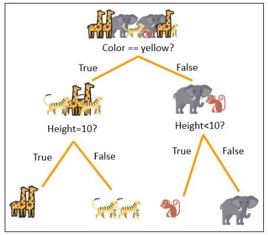
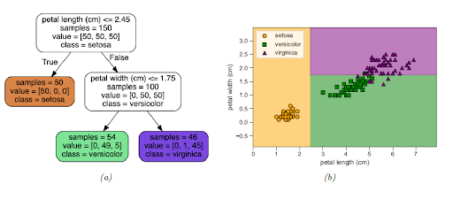
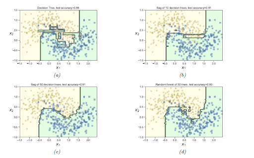
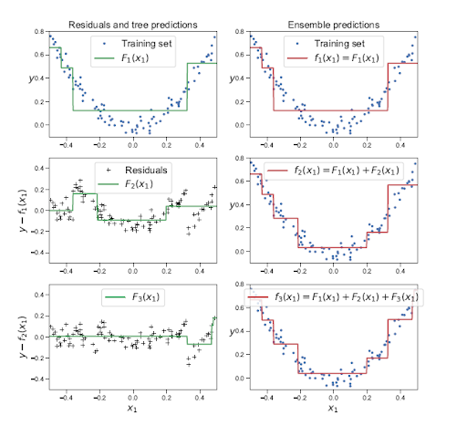

# Supervised Learning. Decision Trees and ensembles

Summary: This project introduces decision trees (CART) and ensemble methods (Random Forest, GBDT).

💡 [Tap here](https://new.oprosso.net/p/4cb31ec3f47a4596bc758ea1861fb624) **to leave your feedback on the project**. It's anonymous and will help our team make your educational experience better. We recommend completing the survey immediately after the project.

## Contents

1. [Chapter I. Preamble](#chapter-i-preamble)
2. [Chapter II. Introduction](#chapter-ii-introduction) \
    2.1. [Decision Tree](#decision-tree) \
    2.2. [Pros of CART](#pros-of-cart) \
    2.3. [Cons of CART](#cons-of-cart) 
3. [Chapter III. Goal](#chapter-iii-goal) 
4. [Chapter IV. Instructions](#chapter-iv-instructions)
5. [Chapter V. Task](#chapter-v-task)
6. [Chapter VI. Bonus part](#chapter-vi-bonus-part)

## Chapter I. Preamble

We have already discussed several algorithms for classification/regression problems. However, the most powerful ML algorithms for tabular data problems are based on decision trees (or **classification and regression trees, CART**). CART models are easy-to-understand, high-explanation models that mimic (or automate) human decision processes. CARTs don't provide good accuracy in most cases, but **ensembling** techniques allow us to build solid and accurate models based on sets of trained CART models.

## Chapter II. Introduction

Classification and regression trees work by recursively partitioning the input space (feature space) and defining a local model in each partition (region). At each node of the tree, we try to come up with the next partitioning suggestion: what kind of partitioning would reduce the entropy or deviation in the subsequent nodes? The overall model can be represented by a (binary) tree, with one leaf per region.

### Decision Tree

The following image (animal classification) gives an overview of how the decision tree works: we recursively partition the input into subspaces; each partition "shifts" us a bit towards the right answer. At level 0 (root node) we don't know the type of animal, at level 1 non-yellow animals go to the right branch, now we can separate animals even more (based on height, weight, etc.), and so on.

*Source [x] (https://www.simplilearn.com/tutorials/machine-learning-tutorial/decision-tree-in-python)*.

There is a decision tree for Elephant as input:
1. Elephant is not yellow, so it goes to the right branch.
2. Elephant is very big, so it goes to the right branch again.

The following picture shows another example of a decision tree, for the classic Iris dataset:

*Source: [x] Murphy*

Figure (a) shows an example of a decision tree for the iris classification problem. Figure (b) shows the decision rule induced by tree (a). 
We can see that CART has partitioned the input space using axis-parallel splits. Each region corresponds to a constant value prediction: for example, each input instance in the orange region is labeled "setosa". CART can be viewed as a linear model on highly nonlinear indicator features (each partition is a combination of comparisons).

The discrete tree structure leads to a nondifferentiable loss function for our problem. Finding the optimal partitioning of the data is an NP-complete problem. The standard practice is to use a **greedy** procedure: we iteratively grow the tree one node at a time, choosing the best possible partition at the current step.

The training procedure consists of the following steps
1. At each step, we compute the reduction in entropy (for the classification problem) or the reduction in standard deviation (for the regression problem) for each possible split. We want the inputs that fall into our new 2 nodes to be more homogeneous in terms of the target variable. 
     Imagine that the task is to classify an animal as elephant or non-elephant based on 3 features: color, weight, height. Possible splits include any color, all weights, etc. Splitting by color is informative (elephants are gray and foxes aren't) but not the best: there are too many different species with gray color; the left subtree (non-gray animals) would have no elephants, but the right subtree (gray animals) would contain not only elephants but many other species.
       In this task, **[weight > 1000 kg]** is the best possible split: elephants are the heaviest land animals.
   This split gives maximum reduction of uncertainty in 2 new nodes:
**[weight >= 1000 kg]** has only elephants, **[weight < 1000 kg]** has no elephants at all (or maybe a marginal amount of tiny, light elephants).
2. After introducing 2 new nodes, we recursively start the splitting process in them.
3. We stop the splitting after some stopping criteria are met (like predefined maximum depth of the tree, too low uncertainty reduction in the following splits, etc.).

### Pros of CART

Decision trees have the following strengths:
* CART models are a good choice when you need an interpretable model: explaining the prediction of the tree model means traversing the splits of the tree.
* CART can work with mixed distribution datasets. CARTS are nearly insensitive to monotone transformations. Preprocessing techniques such as normalization, scaling, and binning are usually not applied when using CARTS.
* Outliers in features also don't have a strong impact on CART performance.

### Cons of CART

In real-life problems, CART is rarely used as a stand-alone model because it has significant drawbacks:
* CART models are prone to overfitting due to the greedy learning process of the tree.
* Trees are unstable: small changes in the input data can have large effects on the structure of the tree due to the hierarchical nature of the tree-growing process, causing errors at the top to affect the rest of the tree [Murphy].

### Ensemble methods

It is easy to overfit CART models. However, CARTs are actively used as building blocks for other more complex and accurate tree-based models. The instability of CART can be mitigated by averaging many different CART models trained on the same dataset.

The **Random Forest** model is an example of this idea:
1. We create a bunch (typically 100-1000) of CART models using random subsamples of the training data. Typically, we subsample some fraction (say ⅔) of random rows and M random columns from our dataset and use very deep trees. We end up with a pile (**"bag"**) of trained trees that are potentially overfitting and have low accuracy.
2. The output of the random forest model is the *average prediction of each trained tree*. Each tree is overfitted to some portion of the training data, but their average provides a much more stable and accurate prediction.

Fitting different base models to different randomly sampled versions of the data is called **bagging**. Bagging is based on the assumption that re-running the same learning algorithm on different subsets of the data will result in sufficiently different underlying models. The Random Forest model is an example of the use of bagging.

Each tree divides the input space into boxes. Averaging bundles of trees results in a smoother decision boundary. The following figure illustrates this principle:

Figure (a) illustrates the decision boundary for a single tree, (b) corresponds to averaging a bag of 10 trees, (c) corresponds to a Random Forest model with 50 trees. Note that (c) doesn't have the boundary artifacts of (a).

**ExtraTrees** is another type of tree-based model [ET paper]. It is basically Random Forests without subsampling on rows (we only subsample features), using **extra randomized trees** instead of CART. 
Extra randomized trees is a CART model if you take a random split value for each feature: we search for the best splits by looking at only 1 random split for each feature. 
In practice, the ExtraTrees model is less accurate than RandomForest, but less prone to overfitting.

Unfortunately, methods based on multiple trees lose their interpretability properties: we trade high accuracy for a less clear decision process. There are several approaches to explain black-box algorithms: SHAP, LIME, etc.

### Gradient Boosting

Consider a trained decision tree classifier. We can improve the performance of our model by adding another decision tree that tries to correct errors introduced by the first tree. Then we can continue this process by learning another tree that increases the accuracy of our ensemble. The result is called an **additive model**.

*Source: [Murphy]*

The figure shows an additive model with 3 learned CARTs. Tree #2 tries to reduce an error from Tree #1. Tree #3 reduces errors imposed by an ensemble of Tree #1 and Tree #2. How do we learn such an additive model?

From previous lessons, we know about Stochastic Gradient Descent. Updating parameters based on steps toward the loss function anti-gradient makes the ML algorithm's errors smaller.

The same principle can be applied to additive modeling:

* For a differentiable loss function, compute the antigradient of an error at the current step, and train a new decision tree to approximate the antigradient.
      It is equivalent to a supervised problem with:
      **x** as input and negative gradient by A of **Loss(y, A(x))** as a target, where **A(x)** — prediction of current ensemble for instance **x**.
* Add the output (with a small coefficient) of the new tree to the output of the models in the current ensemble.
* We have reduced our loss by adding a new tree to the ensemble. We can repeat the previous steps until we reach some stopping criteria (maximum number of iterations, too small improvements, etc.).

The GBDT training procedure is clearly explained in [4].

Antigradient approximation requires the use of regression trees. The resulting model is called **Gradient Boosting Decision Trees**. In general, any kind of trees (or different ML models) can be used as base learners, but trees are the most convenient. In practice, different implementations of GBDT use different types of base trees.

The final form of the GBDT model is reminiscent of RandomForest: it is a linear combination of many trees. However, in the GBDT training scheme, each tree is built on the result of the previous trees, whereas in Random Forest, individual trees aren't directly related: we train different CARTs, then average. Usually, GBDT uses some tricks from Random Forest: subsampling of training instances and features.

### Modern Gradient Boosting Implementations

Modern GBDT packages provide the user with dozens of different parameters that control the learning process of each tree in the ensemble. There are several efficient implementations of GBDT: 3 of the most popular GBDT implementations today are LightGBM, Catboost, and XGBoost. They all have hundreds of adjustable parameters, different tree structures, learning regimes, etc.

Quick overview of the differences:
* All three use different trees or learning strategies: depthwise (XGBoost), leafwise (LightGBM), oblivious trees (Catboost).
* LightGBM supports ==/!= splits for categorical data.
* Catboost is dedicated to work with categorical features: smart target encoding is implemented.
* LightGBM and XGBoost have DART mode: learning scheme with dropping subsample of already learned trees.
* LightGBM supports ExtraTrees and Linear Trees (we replace the mean target prediction in the leaf with the LinearRegression prediction).

These articles [1], [2], [3] give a good overview of the best GBDT libraries.

GBDT algorithms are capable of learning extremely complex functions from inputs with mixed distributions. GBDT algorithms are considered the best choice (on average) for tabular data with mixed distributions. The additive nature and use of multiple trees makes GBDT models extremely sophisticated to have a clear interpretation.

### References

[1] https://towardsdatascience.com/catboost-vs-light-gbm-vs-xgboost-5f93620723db

[2] https://medium.com/riskified-technology/xgboost-lightgbm-or-catboost-which-boosting-algorithm-should-i-use-e7fda7bb36bc

[3] https://neptune.ai/blog/when-to-choose-catboost-over-xgboost-or-lightgbm

[4] https://alexanderdyakonov.files.wordpress.com/2017/06/book_boosting_pdf.pdf

[5] https://link.springer.com/content/pdf/10.1007/s10994-006-6226-1.pdf?pdf=button

[6] https://www.simplilearn.com/tutorials/machine-learning-tutorial/decision-tree-in-python

## Chapter III. Goal

The goal of this assignment is to get a deep understanding of tree-based models for classification (CART, Random Forest, GBDT) and modern implementations (LightGBM, XGBoost, Catboost). 

## Chapter IV. Instructions

* This project will be evaluated by humans only. You are free to organize and name your files as you wish.
* We use Python 3 as the only correct version of Python.
* For training deep learning algorithms you can try [Google Colab](https://colab.research.google.com). It offers free kernels (Runtime) with GPU, which is faster than CPU for such tasks.
* The standard does not apply to this project. However, you are asked to be clear and structured in your source code design.
* Store the datasets in the data subfolder.

## Chapter V. Task

1. Download data from [Don’tGetKicked competition](https://www.kaggle.com/c/DontGetKicked).Design train/validation/test split.
      Use the "PurchDate" field to split, test must be later in time than validation, same goes for validation and train: train.PurchDate < valid.PurchDate < test.PurchDate. 
 Use the first 33% of the data for the training, the last 33% of the data for the test, and the middle 33% for the validation set. *Don't use the test dataset until the end!*
  Use LabelEncoder or OneHotEncoder from sklearn to preprocess categorical variables. Be careful with data leakage (fit Encoder to training and apply to validation & test). Consider another coding approach if you encounter new categorical values in validation & test (not seen in training), for example: https://contrib.scikit-learn.org/category_encoders/count.html
2. Create a Python class for Decision Tree Classifier and Decision Tree Regressor (MSE loss).
 It should support *fit*, *predict_proba*, and *predict* methods. Also, the maximum depth (max_depth) must be a parameter of your class. Use the Gini impurity criterion as a criterion for choosing the split.
  Here is the blueprint:
  **model = DecisionTreeClassifier(max_depth=7)**
 **model.fit(Xtrain, ytrain)**
 **model.predict_proba(Xvalid)**  
   * Create a separate class for Node. It should be able to hold data (sample features and targets), compute Gini impurity, and have pointers to children (left and right nodes). For the Regressor, use standard deviation instead of Gini impurity. 
   * Implement a function that finds the best possible split in the current node. 
   * Combine the previous steps into your working Decision Tree Classifier.
   * Implement an Extra Randomized Tree by designing another function to find the best split.
3. With your DecisionTree module, you must obtain a Gini score of at least 0.1 on the validation dataset.
4. Use sklearn's DecisionTreeClassifier and check its performance on the validation dataset. Is it better than your module? If so, why?
5. Implement the RandomForestClassifier and check its performance. You have to improve the result of a single tree and get at least 0.15 Gini score on the validation dataset. Be able to set a fixed random seed.
6. Use your DecisionTree design class for GDBT classifier. This class must have *max_depth*, *number_of_trees* and *max_features* attributes. You must compute the gradient of the binary cross-entropy loss function and implement incremental learning: train the next tree using the results of the previous trees.
7. Use LightGBM, Catboost, and XGBoost for fitting on a training set and prediction on a validation set. Review the documentation of the libraries and fine-tune the algorithms for the task.
Note key differences between each implementation. Analyze special features of each algorithm (how does "categorical feature" work in Catboost, what is DART mode in XGBoost)?
Which GBDT model gives the best result? Can you explain why?
8. Take the best model and estimate its performance on the test dataset: check the Gini values on all three datasets for your best model: training Gini, valid Gini, test Gini. Do you see a drop in performance when comparing the valid quality to the test quality? Is your model overfitting or not? Explain.
9*. Implement the ExtraTreesClassifier and check its performance. You must improve the result of a single tree and obtain a Gini score of at least 0.12 on the validation dataset.

## Chapter VI. Bonus Part

Bonus part marked with * in [Chapter V. Task](#chapter-v-task).

>Please leave feedback on the project in the [feedback form.](https://forms.yandex.ru/cloud/646b46eff47e732ee1311d6f/) 

