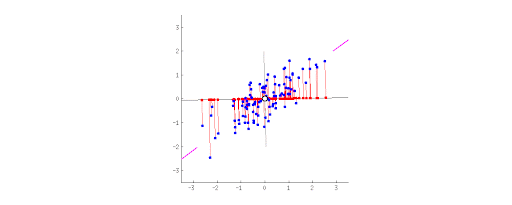

# Unsupervised Learning   Dimensionality Reduction

Summary: This project covers some unsupervised learning tasks, focusing on dimensionality reduction.

💡 [Tap here](https://new.oprosso.net/p/4cb31ec3f47a4596bc758ea1861fb624) **to leave your feedback on the project**. It's anonymous and will help our team make your educational experience better. We recommend completing the survey immediately after the project.

## Contents

1. [Chapter I. Preamble](#chapter-i-preamble)
2. [Chapter II. Introduction](#chapter-ii-introduction) \
    2.1. [What is Dimentional reduction](#what-is-dimensional-reduction) \
    2.2. [Matrix Factorization methods](#matrix-factorization-methods) \
    2.3. [Manifold learning](#manifold-learning) 
3. [Chapter III. Goal](#chapter-iii-goal) 
4. [Chapter IV. Instructions](#chapter-iv-instructions)
5. [Chapter V. Task](#chapter-v-task) \
   5.1. [Dataset](#dataset) \
         5.1.1. [Book Recommendation Dataset](#book-recommendation-dataset) \
         5.1.2. [Mnist](#mnist) \
         5.1.3. [Background models challenge](#background-models-challenge) \
   5.2. [Task](#task) \
   5.3. [Submission](#submission)
6. [Chapter VI. Bonus part](#chapter-vi-bonus-part)

## Chapter I. Preamble

In previous projects, we focused on supervised learning — when each data sample we describe with features has a target variable that we want to learn how to predict. In this project, we will get acquainted with the problems of unsupervised learning — the case when we do not have the target variable, but we still want to find patterns in the data and use them for good.

We can start with the problem of dimensionality reduction, one of the subtasks of unsupervised learning. To explain the use cases of these models, let's go back to supervised learning. Imagine a situation where we have already trained a baseline model and realized that its quality is not very good. Then we decided to correct this situation by adding new features. But we don't really want to create them manually, so we decided to encode each feature into several others using the formula *sin (ax + b) * c*. 
Where a, b, and c are the parameters that we iterate through along the given grid. How dangerous is this situation? It is likely that most of these functions will be useless. While some of them may even be randomly transformed in such a way that the model will find a pattern between the target variable and that feature, leading to model overfitting.

This problem is closely related to the Curse of Dimensionality, first introduced by Richard E. Bellman. 
As we add and add new features (in other words, increase the dimension), we need n times more observations each time to get the same density of observations (see the figure below). Thus, in order to obtain an estimate of an unknown function as accurate as before, the amount of data required must grow exponentially with increasing dimension.

Source: [What do you mean by Curse of Dimensionality? What are the different ways to deal with it?](https://www.i2tutorials.com/what-do-you-mean-by-curse-of-dimensionality-what-are-the-different-ways-to-deal-with-it/)

For the supervised learning task, this problem can result in
1. that we increase the distance between samples;
2. that, as mentioned above, we can add noise from which the model will extract patterns and thus overfit;
3. that models fitting time and memory usage will increase.

Fortunately, not all models are equally affected. 
Think about which of the models we have studied so far are affected by this problem. Explain why.

To deal with this problem, you can perform feature selection before training the model. For example, train a lasso model and look at the coefficients of the model. Or use other approaches that you will use in Project 3.

The purpose of the current project is to introduce you to a number of approaches that are used for dimensionality reduction. In addition, some of these approaches can be applied to other unsupervised learning tasks. For example, for compressing media content, for highlighting the background of a video, for building recommender systems, for interpreting results, and much more. In this project we will apply some of them.

## Chapter II. Introduction

### What is Dimensional Reduction

In the case of dimensionality reduction, our main goal is to transform data from a high-dimensional feature space to a low-dimensional feature space. This is done in such a way that information about the important properties of the samples is not lost: similar samples should remain similar and different samples should be different. Most often, this approach is used to visualize datasets in two- or three-dimensional space (see the figure below) or to speed up the training of other machine learning models.

Image of dimensionality reduction of handwritten numbers from the MNIST dataset. 
Source: https://neptune.ai/blog/dimensionality-reduction

Within the problem of dimensionality reduction, there are many approaches, and to make it easier to navigate through them, you can divide them into groups.

### Matrix Factorization methods

We mentioned above that we do not have a target variable, but rather features that we collect in the form of a matrix. 
From linear algebra, we know that matrices can be decomposed in several ways. 
We can represent the matrix as a product of a lower triangle and an upper triangle (LU decomposition), or as a product of an orthogonal matrix and an upper triangle (QR decomposition), or we can find eigenvectors and use them as a basis for matrix decomposition, etc. The most important of these decompositions is the Singular Value Decomposition (SVD).

The SVD is a factorization in which the input matrix $$ M_{n \times m} $$ is decomposed into:

$$ M_{n \times m}=U_{n \times r}\Sigma_{r \times r}V_{m \times r}^T, \text{ where } r =\min (n, m)$$

where
* *U* and *V* are orthogonal matrices, 
* $`\Sigma`$ is a diagonal matrix containing the singular values of the matrix A.

Recall that orthogonal matrices are just rotations and reflections that leave the sphere the same. From a geometric point of view, this means that any matrix can be decomposed as a rotation, followed by an extension, followed by another rotation.

Source: [wikipedia](https://en.wikipedia.org/wiki/Singular_value_decomposition)

The key property of this decomposition is that we can use SVD to find the k-rank best approximation of the original 
matrix. Let me explain what that means:
* The matrices *U* and *V* contain the left and right eigenvectors, the matrix $`\Sigma`$ contains the singular values.
* If we crop *U*, *V*, $`\Sigma`$ and take first k eigenvectors with corresponding singular values and multiply cropped matrices
$$ U_{n \times k}\Sigma_{k \times k}V_{m \times k}^T = M_{n \times m}^k $$ the resulting matrix $$ M_{n \times m}^k $$ will have rank k and the same shape as the matrix *M*. 
* Thus we can calculate how similar the elements of the two matrices are. To calculate their similarity, we will use the Frobenius norm. And this property says that out of all possible approximations with rank k, $$ M_{n \times m}^k $$ will be the best (in terms of Frobenius norm).

$$M_{n \times m}^k = \arg \min_{\bar{M}: \text{rank}(\bar{M})=k} \|M - \bar{M}\|_F = \arg \min_{\bar{M}: \text{rank}(\bar{M})=k} \sqrt{\sum_{i,j}\left(M_{ij}-\bar{M_{ij}}\right)^2}$$

Ok, we have some properties, but how can we use SVD for dimensionality reduction? 
Basically, we can just use $`U_k`$ if we want to compress a high-dimensional matrix, and that is it. 
$`\Sigma_k V_k^T`$ will consist of the base vectors we use for factorization. 
And the above property will guarantee us that this will be the best approximation.

Another important property of SVD is that the first right eigenvector (from the matrix V) will cover the direction where the variance of our sample will have the maximum value (see the gif below, you can also visit the source link for a better example). What does this mean? If we take the left eigenvector as a new axis and then project all the samples onto it, we get the sequence of values. If we then calculate the variance of this sequence, it will be the maximum of all possible variants. In other words, this direction explains our data most effectively. And what about the second eigenvector? It will represent the direction with the best correction to our first eigenvector. And so on.

Source: [stats.stackexchange.com](https://stats.stackexchange.com/questions/2691/making-sense-of-principal-component-analysis-eigenvectors-eigenvalues/140579) 

To use SVD in sklearn, you should use the PCA class within the sklearn.decomposition module. 
Please write down in your notebook the answer to the question: "What is the difference between PCA and SVD?"

SVD is not the only way we can decompose the matrix. 
Therefore, it is not the only way to reduce dimensionality. 
Another way is to use Non-Negative Matrix Factorization (NMF). Understanding the difference between NMF and SVD is also part of this project.

All the decompositions we have mentioned have transformed our features linearly. 
But what if there are nonlinear dependencies in the data? You can use kernel functions, just like in SVM. 
In simple words, the use of the kernel function will be similar to the non-linear transformation of the input features and the further use of linear methods. For example, if we use a polynomial kernel with degree = 2 and we have 2 features [x1; x2], then this is equivalent to using features [1; x1; x2; x12; x1x2; x22]. However, there is a separate class of methods that allow learning nonlinear dependencies. Let's move on to them.

### Manifold learning

Manifold learning is an approach to nonlinear dimensionality reduction.

We will start with t-Distributed Stochastic Neighbor Embedding or t-SNE. 
This is perhaps the most popular method for visualizing features in 2D or 3D space. 
We will try to explain how it works on the fingers:
1. First, we create random vectors for each observation in compressed space.
2. Second, in high-dimensional space, we count the distance between all possible pairs of our observations. And then we convert this distance into a probability, so that the sum of the probabilities to all other points equals 1 (use softmax for this).
3. At the same time, we repeat the distance measurement in low-dimensional space.
4. Let's take 1 observation. If the probability distributions to every other point are similar in both spaces, then we have built an excellent compressed representation. To measure this distance, there is a special loss that measures the similarity of the distributions. This loss is called the Kullback-Leiber divergence:  
$$ D_{KL}(P\|Q)=\sum_{i=1}^n p_i \log \frac{p_i}{q_i}$$
5. Now that we have a loss, we can calculate the gradient and update the sample vector in the compressed representation. By repeating steps 2-5 many times, the approach will converge to a solution that tends to minimize the distance between the distributions. 

It is worth mentioning that for better convergence, instead of using random vectors in the 1st step, it is better to use some pre-trained compression. PCA is often used to generate starting points for algorithms. Coupled with the fact that t-SNE requires a lot of computational resources, this can save on computation.

Recently, however, an alternative method has emerged that adds several optimizations to the t-SNE approach — called Uniform Manifold Approximation and Projection (UMAP). Instead of building a probability distribution over all samples, the authors proposed to extract the k-nearest neighbors and use only those during optimization. This approach is available in a separate UMAP library.

Also from the proven approaches is Locally Linear Embedding. Understanding and describing how it works is part of your task.

## Chapter III. Goal

The goals of this project are:
* get a deep understanding of how to build dimensionality reduction models and for which task they can be applied;
* try out methods from the dimensionality reduction field in other unsupervised learning tasks.

## Chapter IV. Instructions

* This project will be evaluated by humans only. You are free to organize and name your files as you wish.
* We use Python 3 as the only correct version of Python.
* For training deep learning algorithms you can try [Google Colab](https://colab.research.google.com). It offers free kernels (Runtime) with GPU, which is faster than CPU for such tasks. The standard does not apply to this project. However, you are asked to be clear and structured in your source code design.
* Store the datasets in the data subdirectory.

## Chapter V. Task

### Dataset

#### Book Recommendation Dataset

Source: https://www.kaggle.com/datasets/arashnic/book-recommendation-dataset

We need to download 2 files: Ratings.csv and Users.csv. Ratings are needed to create sparse features for each user. 
The i-th feature is whether a user has given the rating for book i or not. Users are required to have age as a target variable.

#### Mnist

Source: http://yann.lecun.com/exdb/mnist/ 

"Hello world" dataset for handwriting digit recognition. Many libraries have built-in tools to load this dataset.

#### Background models challenge

Source: http://backgroundmodelschallenge.eu/

Consists of several videos from street cameras. We only need one of them in bmc_real.zip

### Task

1. Answer the questions from the Preamble and Introduction
   1. For which of the models already studied is the curse of dimensionality relevant and explain why.
   2. What is the difference between PCA and SVD?
   3. What is the difference between NMF and SVD?
   4. Describe the structure of the Locally Linear Embedding dimension reduction algorithm.

2. Classification with Sparse Features
   1. Load the "Book Recommendation Dataset" ([source](https://www.kaggle.com/datasets/arashnic/book-recommendation-dataset)).
   2. Create a matrix of user-book interactions. Using Sparse Matrices.
   3. Split the dataset into training, valid, and test parts.
   4. Build linear and random forest models to predict user age based on user-book interactions. Do not forget to choose optimal parameters.
   5. Use PCA and UMAP to reduce the dimensionality of the features.
   6. Build linear model and random forest model on the compressed features.
   7. Compare fitting time and quality for models from d and f.

3. Visualizations
   1. Load the MNIST dataset ([source](http://yann.lecun.com/exdb/mnist/)).
   2. Represent each digit image as a vector.
   3. Transform vectors up to 2 dimensions using PCA, SVD, Randomized-SVD, TSNE, UMAP, and LLE.
   4. Propose metrics and compare models based on how well they separate digit classes.

4. Image compression using SVD
   1. Select 3 random grayscale images and load them into matrix using Python.
   2. Decompose the matrix using SVD.
   3. Vary the rank, compute a low-rank approximation of the original matrix, and plot the recovered image. Use up to 10 different ranks. What does the singular value spectrum look like and how many modes are needed for good image reconstruction?
   4. Plot the distribution of explained variance versus rank. Explain what "explained variance" is.

5. Background detection using SVD
   1. Load "Video_008.avi" ([source](http://backgroundmodelschallenge.eu/) — bmc_real.zip).
   2. Represent the video as a matrix and decompose it using SVD.
   3. Reconstruct the first frame using low-rank approximation. What rank should you use to get the background?
   
### Submission

Save one of the models from the "Visualizations" part of the task. Your peer will load it and use it to compress one of the handwritten digits. The compressed vector should have the same values.

Your repository should contain one or more notebooks with your solutions.

## Chapter VI. Bonus part

* Using the [face expression recognition dataset](https://www.kaggle.com/datasets/jonathanoheix/face-expression-recognition-dataset), fit the dimensionality reduction model to compress faces. Using the representations, try to turn a sad face into a smiley face and vice versa.

>Please leave feedback on the project in the [feedback form.](https://forms.yandex.ru/cloud/646b476102848f2ee1031b24/) 
