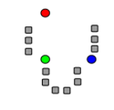
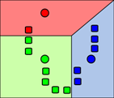
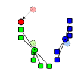
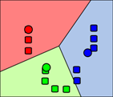
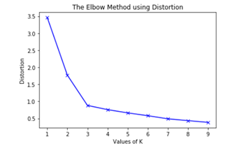
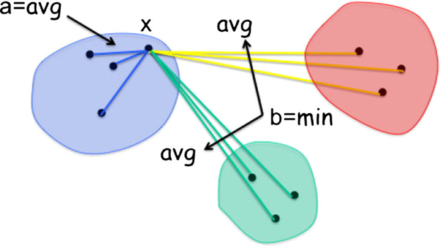
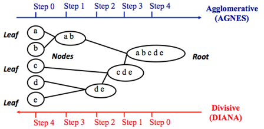

# Unsupervised learning. Clustering

Summary: This project focuses on different clustering algorithms. We will discuss how to apply and use clustering models. We will try to combine clustering with supervised learning by adding labels to clusters as new features, and measuring model quality.

💡 [Tap here](https://new.oprosso.net/p/4cb31ec3f47a4596bc758ea1861fb624) **to leave your feedback on the project**. It's anonymous and will help our team make your educational experience better. We recommend completing the survey immediately after the project.

## Contents

1. [Chapter I. Preamble](#chapter-i-preamble)
2. [Chapter II. Introduction](#chapter-ii-introduction)
    1. [K-means clustering](#k-means-clustering)
    2. [Choosing the number of clusters K](#choosing-the-number-of-clusters-k)
        1. [Elbow method](#elbow-method)
        2. [Silhouette coefficient](#silhouette-coefficient)
    3. [Hierarchical clustering](#hierarchical-clustering)
    4. [DBSCAN](#dbscan)
    5. [The EM algorithm](#the-em-algorithm)
3. [Chapter III. Goal](#chapter-iii-goal)
4. [Chapter IV. Instructions](#chapter-iv-instructions)
5. [Chapter V. Task](#chapter-v-task)
    1. [Part 1](#part-1)
    2. [Part 2. Bonus](#part-2-bonus)
6. [Chapter VI. Submission](#chapter-vi-submission)

## Chapter I. Preamble

We already know what unsupervised learning is, and this project will be about one of its subtasks — clustering. Clustering is the association of similar objects into groups or clusters. Sometimes it is also called cluster analysis or segmentation. The input is the same as in the previous tasks — a high-dimensional feature vector, while the output is the identifier of the group to which we should assign our vector.

It often happens in unsupervised learning that it is difficult to evaluate the quality of a clustering algorithm. If we have labeled data for some of the data, we can use the similarity between the labels of two data points as a metric to determine whether the two inputs "should" be assigned to the same cluster or not. Let's say you want to organize your home library. You choose four books of different genres and put them on separate shelves. Now you need to consider the genres of the other books and distribute them among the shelves. It is also possible to group books by size or cover color.

Let's look at some examples where clustering is useful in:

- Mapping geolocation coordinates or addresses to meaningful locations and populations;
- Identifying fraud through atypical behavior: for example, fake clicks or likes on social networks;
- Clustering social network posts by topic.

Moreover, clustering in all these examples could be used not only as a standalone tool, but also as a helper for other tasks, for example, we can use the average rental price within the geolocation cluster as a feature to predict which hotel to suggest to the user. Another use case of clustering as a helper is to find nearest neighbors (find Approximate Nearest Neighbors to get a better understanding). With this in mind, we move on to the models that can be used for clustering.

## Chapter II. Introduction

### K-means clustering

Let's look at the most popular clustering algorithm - the K-means method.

The key concept of the algorithm — the centroid, or the center of the cluster. The degree of affinity (distance) to a particular center determines which cluster an object belongs to. Each cluster has its own centroid, and it is calculated as the average of the cluster objects. But how to select centroids in the most appropriate way?

As often as the K-means clustering is adapted, we will use an iterative algorithm. The algorithm randomly assigns each object a cluster number, from 1 to k, and then repeats 2 steps:

- Update step — calculates the centroid of each cluster;
- Assignment step — each object is assigned to a new cluster whose centroid is closest to the object.

We repeat these steps until the centroids of the clusters do not change anymore. But there are other ways to initialize centroids for each cluster. For example, Forgy initialization. Which initialization is shown in the figure below? Think about the advantages of such an initialization. *Source: [Wikipedia](https://en.wikipedia.org/wiki/K-means_clustering)*.

|||||
|-|-|-|-|
|Update step|Assignment step|Update step|Assignment step|

Mathematically, we find a local minimum of the following cost function, known as the distortion:

$$\sum_{n=1}^N \|\mathbf{x}_n - \boldsymbol{\mu}_{z_n}\|^2$$

where $$\boldsymbol{\mu}_k = \frac{1}{N_k}\sum_{n:z_n=k}\mathbf{x}_n$$  is the k-cluster center and $$z_n^* = \arg \min_k \| \mathbf{x}_n - \boldsymbol{\mu}_k \|^2$$ is the closest cluster of $$\mathbf{x}_n$$.

In describing the approach, we miss an important detail — we take the number of clusters for granted and do not consider how to choose this value.

### Choosing the Number of Clusters K

The K-means cost function decreases as the number of clusters increases. If each object has a separate cluster, then the distance in clusters is zero. So we minimize the cost function, but that's not valid clustering: in fact, there are no clusters, only independent objects. So how do we choose the best number of clusters?

#### Elbow method

In K-means clustering, the number of clusters is often estimated using the "elbow method". It involves repeated cyclic execution of the algorithm with an increasing number of clusters. We then plot the number of clusters on the X-axis and the value of the bias on the Y-axis.

The value of the cost function first decreases sharply and then reaches a plateau. This point of transition reflects the optimal number of clusters. In this case, the plateau begins after we add the third cluster. However, this may not be the correct result. Suppose we have clusters painted in 5 colors, but there are two very close clusters among them. So this method will not define these clusters as different.

#### Silhouette coefficient

Let's describe a stricter heuristic method for choosing the number of clusters in a K-means model. This is based on spherical (not elongated) clusters.

The **"silhouette" coefficient** is computed using the average intra-cluster distance (a) and the average distance to the nearest cluster (b) for each instance i. We define the silhouette coefficient of an instance i as $` \text{sc}(i) = (b_i - a_i) / \max(a_i, b_i) `$. *Source: [Hidden Markov models for malware classification](https://www.researchgate.net/publication/272017073_Hidden_Markov_models_for_malware_classification)*

What does it mean? This coefficient varies between -1 and +1. If it is +1, the instance is close to all members of its cluster and far from other clusters; a value of 0 means it is close to a cluster boundary; and a value of -1 means it may be in the wrong cluster. Then it is possible to calculate the **silhouette score** of a clustering K as the average silhouette coefficient over all samples.

According to a previous example with 5 clusters, this method will show that the silhouette score increases up to k=5 and then decreases sharply for higher values of k. That is, we get a peak at k=5, which is the number of clusters generated in the original dataset.

In summary, the silhouette graph has a peaked character, as opposed to the gently curved graph of the elbow method.

### Hierarchical clustering

Now we'll take a quick look at hierarchical clustering. It is an alternative approach to K-means clustering. It has an advantage: this technique does not require the generation of a predetermined number of clusters, as is the case with K-means.

In the case of hierarchical clustering, it is appropriate to consider approaches: **agglomerative** and **divisive** clustering. Take a look at the popular diagram that shows bottom-up and top-down methods:

The first technique is also known as AGNES (Agglomerative Nesting). It is a bottom-up algorithm. That is, we start from a leaf and move to the root. At each step of the algorithm, the two most similar clusters are combined into a new larger cluster (node). This process is repeated until all points become members of a single large cluster (root).

The inverse method is also known as DIANA (Divise Analysis) and works in a top-down manner. We start from the root, where all objects are contained in a single cluster. At each iteration step, the most heterogeneous cluster is divided into two. The process is iterated until all objects are in their own cluster.

A key definition in these algorithms is the measure of the (dis)similarity of the observations. You should choose a convenient measure of distance (e.g., Euclidean distance, Manhattan distance, etc.). In the practical part, you'll explore the documentation of [sklearn](https://scikit-learn.org/stable/modules/classes.html#module-sklearn.cluster) to test different metrics.

### DBSCAN

DBSCAN (Density-based spatial clustering of applications with noise) is a method that works with data density. It takes two parameters as input: the radius of the neighborhood and the number of neighbors. Let's consider a simple example to understand the DBSCAN technique.

There are many guests in a party room. Some of them are talking in groups, some are dancing, and some people are alone or walking around with champagne. We want to divide the people in the room into groups.

But how to distinguish groups of such different forms, and not to forget about singles? Let's try to estimate the density of the crowd around each person. Density is the feature of DBSCAN.

Let's say that a crowd has gathered around a certain person if several other people are standing close to him. It is obvious that we need to define two parameters:

1. What does "close" mean? Let's take an intuitive distance: if people can touch each other's heads, then they are close.
2. What does "several" mean? Let's say three people.
Now let's define two lists of guests: people in groups and hermits. Hermits are guests who don't definitely belong to a group. We'll look at each person in the room and define a group to which they belong.

An iterative approach is as follows:

1. We pick a random person from the crowd.
2. If there are less than three people next to him, we put him on the list of possible hermits and choose someone else.
3. Otherwise:
    1. We exclude him from the list of people who need to move around.
    2. We give this person a green flag and create a new group where he is the only member so far.
    3. We walk around all of his neighbors. If his neighbor is already on the list of potential loners, or there are few other people next to him, then we have the edge of the crowd. For simplicity, you can mark him with a yellow flag right away, join the group, and continue bypassing. If the neighbor also turns out to be "green", we do not create a new group, but join an existing one; we also add a neighbor to the bypass list of neighbors. Repeat this step until the redirection list is empty.
4. We repeat steps 1-3 until we have bypassed all people in one way or another.
5. Now we deal with the list of hermits. If in step 3 we have already bypassed all the peripheral people, then there are only a few outliers left — you can finish right away. If not, you will have to distribute the remaining people in the list somehow.

Thus, DBSCAN is a very useful technique because:

- we can use it when we expect clusters of exotic shape or we have a data with noise;
- the complexity of the elements of the dataset does not matter;
- the number of outliers does not matter if they are distributed over a large scale.

But there are some drawbacks:

- The inability to connect clusters through empty spaces and, on the contrary, the ability to connect different clusters through long and thin clusters of high density.

### The EM Algorithm

EM is the **expectation maximization** algorithm. This method is designed for clustering models with missing data and/or hidden variables and helps solve Gaussian Mixture Models (GMM). Here, we assume that all data points are generated from a mixture of a finite number of Gaussian distributions with unknown parameters. We need to know which sample belongs to which Gaussian in order to estimate the parameters of the distributions. It is convenient to think of GMM as a generalized K-means clustering with respect to the covariance structure of the data. A short implementation of GMM can be found in the [sklearn](https://scikit-learn.org/stable/modules/mixture.html) documentation.

The goal of EM is to maximize the log-likelihood of the observed data:

$$l(\boldsymbol{\theta}) = \sum_{n=1}^{N_D} \log p(\mathbf{y}_n | \boldsymbol{\theta}) = \sum_{n=1}^{N_D} \log \left[ \sum_{\mathbf{z}_n} p(\mathbf{y}_n, \mathbf{z}_n | \boldsymbol{\theta}) \right]$$

where $`\theta`$ are Gaussian parameters, $`z_n`$ zn are hidden data and $`y_n`$ are the visible variables.

The general idea of the EM method is to vary the computations from the expectation step E to the maximization step M. The first is to estimate the hidden variables, and the second is to compute MLE (Maximum Likelihood Estimation).

In general, the EM algorithm consists in repeating the following steps until convergence:

1. Expectation step: Compute $`p(y_n, z_n | \theta)`$ In other words, does the hidden sample $`z_n`$ look like it comes from cluster k?
2. Maximization step: Update the Gaussian parameters ($`\theta`$) to fit the points assigned to them.

This algorithm seems to be very effective because of the distribution interpretation, but there is a drawback. It only guarantees convergence to a local optimum, but it does not guarantee that this local optimum is also the global one. Thus, if we start from different initial points, we may end up in different configurations. The same applies to K-means.

## Chapter III. Goal

The goal of this task is to get a deep understanding of clustering algorithms, implement some of them, and generate new features with model quality estimation.

## Chapter IV. Instructions

- This project will be evaluated by humans only. You are free to organize and name your files as you wish.
- Here and further we use Python 3 as the only correct version of Python.
- For training deep learning algorithms you can try [Google Colab](https://colab.research.google.com/). It offers free kernels (Runtime) with GPU, which is faster than CPU for such tasks.
- The standard does not apply to this project. However, you are asked to be clear and structured in your source code design.
- Store the datasets in the subfolder data

## Chapter V. Task

We will continue our practice with a problem from *Kaggle.com*. In this chapter, we will implement methods for clustering, tune these methods to find the optimal number of clusters, and add these labels as features in our model and measure quality.

### Part 1

1. Answer the questions:
    1. Propose a new method to initialize cluster centroids for K-means. List the advantages and disadvantages of Forgy, Random Partition, and your own initializations.
    2. Describe how you can use clustering to speed up the KNN model. Hint: what is kd-tree?
2. Introduction: make all the preprocessing personnel from the previous lesson.
    1. Import libraries.
    2. Read training and test examples.
    3. Preprocess interest level function.
    4. Create features:  'Elevator', 'HardwoodFloors', 'CatsAllowed', 'DogsAllowed', 'Doorman', 'Dishwasher', 'NoFee', 'LaundryinBuilding', 'FitnessCenter', 'Pre-War', 'LaundryinUnit', 'RoofDeck', 'OutdoorSpace', 'DiningRoom', 'HighSpeedInternet', 'Balcony', 'SwimmingPool', 'LaundryInBuilding', 'NewConstruction', 'Terrace'.
3. Implement the next method:
    1. K-means algorithm.
    2. Fit cluster algorithm with 30 clusters on 'longitude' and 'latitude' features, make prediction for training and test samples.
    3. Compute Silhouette score and Distortion.
    4. Draw result with scatterplot, try to analyze it.
    5. Add the label of the cluster as a feature in the Lasso Regression with MinMaxScaller.
    6. Print the feature importance as the feature weight from the Lasso.
    7. Import K-means from sklearn and compare results.
4. Do the same steps, but with the DBScan algorithm (try different parameters for better Lasso model quality).
5. Next, do the same steps as before, but the implementation of the AgglomerativeClustering algorithm is not mandatory for you, you can import it from sklearn.
6. Do the same for the Gaussian Mixture algorithm.
7. Try all these algorithms with different sets of features that might be more efficient in clustering. In the checklist will cluster for 3 features — bedrooms, bathrooms and interest_level.
8. Compare the results with the complexity, speed and accuracy of these methods.

### Part 2. Bonus

1. For additional task, you can try different models instead of Lasso.
2. You could apply optimization methods to hyperparameters of algorithms, e.g. to find the optimal number of clusters.
3. You could combine cluster features from different algorithms and apply feature selection from previous chapters.

## Chapter VI. Submission

Save your code in the Python Jupyter notebook. Your peer will load it and compare it to the baseline solution. Your code should include answers to all mandatory questions. The `additional` task is up to you.

>Please leave feedback on the project in the [feedback form.]( https://forms.yandex.ru/cloud/646b47725d2a062a69d85892/) 
